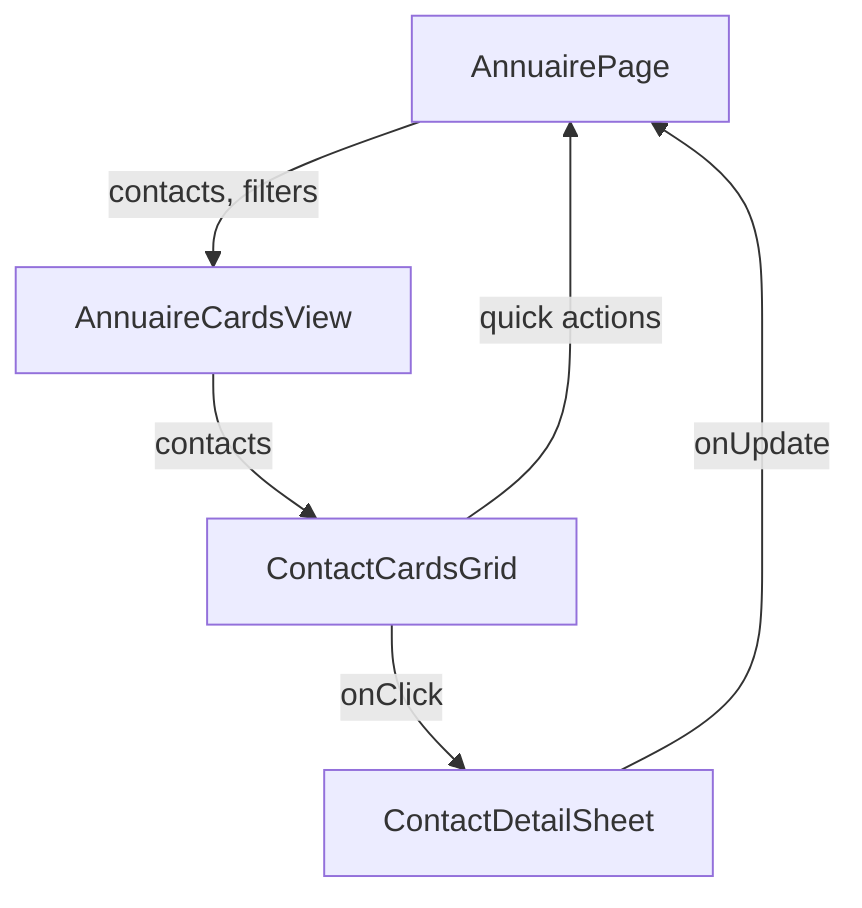

# Design Document - Refonte Annuaire Cards

## Overview

Cette refonte transforme la page Annuaire en mode Cards pour offrir une expérience utilisateur moderne et efficace. Le design se concentre sur :

1. **Grille de cards compactes** : Affichage optimisé avec 3-4 cards par ligne selon la taille d'écran
2. **Panneau de détails** : Sheet latéral (shadcn/ui) qui s'ouvre au clic sur une card
3. **Actions rapides** : Boutons d'action visibles au survol des cards
4. **Design moderne** : Utilisation complète de shadcn/ui avec animations smooth

## Architecture

### Structure des composants

```
AnnuairePage (container)
├── Toolbar (filtres, recherche, actions)
├── ViewSwitcher (cards/table)
└── AnnuaireCardsView (refonte)
    ├── ContactCardsGrid (nouveau)
    │   └── ContactCard (nouveau - compact)
    └── ContactDetailSheet (nouveau - shadcn Sheet)
        ├── ContactHeader
        ├── ContactActions
        ├── ContactInfo
        └── ContactHistory
```

### Flux de données



## Components and Interfaces

### 1. ContactCard (Nouveau composant compact)

**Responsabilité** : Afficher une card compacte avec les infos essentielles

**Props** :
```typescript
interface ContactCardProps {
  contact: DirectoryContact
  isSelected: boolean
  onClick: () => void
  onQuickAction: (action: QuickAction, contact: DirectoryContact) => void
}

type QuickAction = 'call' | 'sms' | 'email'
```

**Design visuel** :
- Taille : `min-h-[140px]` avec padding réduit
- Layout : Vertical stack avec avatar en haut
- Hover : Élévation + affichage des boutons d'action rapide
- Selected : Border primary + shadow

**Structure** :
```tsx
<Card className="group relative">
  {/* Avatar + Nom */}
  <div className="flex flex-col items-center gap-2 p-4">
    <Avatar size="lg" />
    <h3 className="font-semibold text-center line-clamp-1">{fullName}</h3>
  </div>
  
  {/* Infos essentielles */}
  <div className="px-4 pb-3 space-y-1.5">
    <div className="flex items-center gap-1.5 text-xs">
      <Phone className="h-3 w-3" />
      <span>{telephone}</span>
    </div>
    <Badge>{status}</Badge>
    {reminder && (
      <div className="flex items-center gap-1.5 text-xs text-muted-foreground">
        <Bell className="h-3 w-3" />
        <span>{reminder.label}</span>
      </div>
    )}
  </div>
  
  {/* Actions rapides (visible au hover) */}
  <div className="absolute inset-x-0 bottom-0 flex gap-1 p-2 bg-gradient-to-t from-background/95 to-transparent opacity-0 group-hover:opacity-100 transition-opacity">
    <Button size="icon" variant="ghost" onClick={onCall}>
      <Phone />
    </Button>
    <Button size="icon" variant="ghost" onClick={onSMS}>
      <MessageSquare />
    </Button>
    <Button size="icon" variant="ghost" onClick={onEmail}>
      <Mail />
    </Button>
  </div>
</Card>
```

### 2. ContactCardsGrid (Nouveau composant)

**Responsabilité** : Gérer la grille responsive et la virtualisation

**Props** :
```typescript
interface ContactCardsGridProps {
  contacts: DirectoryContact[]
  selectedId: string | null
  onSelectContact: (id: string) => void
  onQuickAction: (action: QuickAction, contact: DirectoryContact) => void
}
```

**Layout responsive** :
```css
.cards-grid {
  display: grid;
  gap: 1rem;
  padding: 1rem;
  
  /* 1 colonne sur mobile */
  grid-template-columns: repeat(1, minmax(0, 1fr));
  
  /* 2 colonnes sur tablette */
  @media (min-width: 768px) {
    grid-template-columns: repeat(2, minmax(0, 1fr));
  }
  
  /* 3 colonnes sur desktop */
  @media (min-width: 1024px) {
    grid-template-columns: repeat(3, minmax(0, 1fr));
  }
  
  /* 4 colonnes sur large desktop */
  @media (min-width: 1280px) {
    grid-template-columns: repeat(4, minmax(0, 1fr));
  }
}
```

**Virtualisation** :
- Utiliser `react-window` ou `@tanstack/react-virtual` pour les grandes listes
- Charger initialement 40 cards, puis lazy load au scroll
- Maintenir les performances à 60fps

### 3. ContactDetailSheet (Nouveau composant)

**Responsabilité** : Afficher tous les détails et l'historique dans un Sheet

**Props** :
```typescript
interface ContactDetailSheetProps {
  contact: DirectoryContact | null
  open: boolean
  onOpenChange: (open: boolean) => void
  onUpdateField: (field: AnnuaireEditableField, value: string) => Promise<void>
}
```

**Utilisation de shadcn Sheet** :
```tsx
<Sheet open={open} onOpenChange={onOpenChange}>
  <SheetContent side="right" className="w-full sm:max-w-2xl overflow-y-auto">
    <SheetHeader>
      <ContactHeader contact={contact} />
      <ContactActions contact={contact} />
    </SheetHeader>
    
    <Separator className="my-4" />
    
    <Tabs defaultValue="info">
      <TabsList className="grid w-full grid-cols-2">
        <TabsTrigger value="info">Informations</TabsTrigger>
        <TabsTrigger value="history">Historique</TabsTrigger>
      </TabsList>
      
      <TabsContent value="info">
        <ContactInfo contact={contact} onUpdate={onUpdateField} />
      </TabsContent>
      
      <TabsContent value="history">
        <ContactHistory history={contact.history} />
      </TabsContent>
    </Tabs>
  </SheetContent>
</Sheet>
```

### 4. ContactHeader (Sous-composant du Sheet)

**Structure** :
```tsx
<div className="flex items-start gap-4">
  <Avatar className="h-16 w-16 border-2">
    <AvatarFallback>{initials}</AvatarFallback>
  </Avatar>
  
  <div className="flex-1 min-w-0">
    <SheetTitle className="text-2xl">{fullName}</SheetTitle>
    <div className="flex flex-wrap gap-2 mt-2 text-sm text-muted-foreground">
      <span className="flex items-center gap-1">
        <Phone className="h-3.5 w-3.5" />
        {telephone}
      </span>
      {email && (
        <span className="flex items-center gap-1">
          <Mail className="h-3.5 w-3.5" />
          {email}
        </span>
      )}
    </div>
    <Badge className="mt-2">{status}</Badge>
  </div>
</div>
```

### 5. ContactActions (Sous-composant du Sheet)

**Structure** :
```tsx
<div className="flex flex-wrap gap-2 mt-4">
  {/* Actions principales */}
  <Button size="sm" className="gap-2 bg-green-500 hover:bg-green-600">
    <Phone className="h-4 w-4" />
    Appeler
  </Button>
  
  <Button size="sm" variant="outline" className="gap-2">
    <MessageSquare className="h-4 w-4" />
    SMS
  </Button>
  
  <Button size="sm" variant="outline" className="gap-2">
    <Mail className="h-4 w-4" />
    Email
  </Button>
  
  {/* Actions secondaires */}
  <Button size="sm" variant="outline" className="gap-2">
    <Bell className="h-4 w-4" />
    Rappel
  </Button>
  
  <Button size="sm" variant="outline" className="gap-2">
    <Calendar className="h-4 w-4" />
    RDV
  </Button>
  
  {/* Recherche externe */}
  <Separator orientation="vertical" className="h-8" />
  
  <Button size="sm" variant="outline" className="gap-2 bg-[#0A66C2] text-white">
    <Linkedin className="h-4 w-4" />
    LinkedIn
  </Button>
  
  <Button size="sm" variant="outline" className="gap-2 bg-[#4285F4] text-white">
    <Globe className="h-4 w-4" />
    Google
  </Button>
</div>
```

### 6. ContactInfo (Sous-composant du Sheet)

**Structure avec sections** :
```tsx
<ScrollArea className="h-[calc(100vh-400px)]">
  <div className="space-y-6 pr-4">
    {/* Informations principales */}
    <section>
      <h3 className="text-sm font-medium mb-3">Informations principales</h3>
      <div className="grid gap-4 sm:grid-cols-2">
        <div className="space-y-2">
          <Label>Prénom</Label>
          <Input value={prenom} readOnly />
        </div>
        <div className="space-y-2">
          <Label>Nom</Label>
          <Input value={nom} readOnly />
        </div>
        {/* ... autres champs */}
      </div>
    </section>
    
    <Separator />
    
    {/* Rappels & Rendez-vous */}
    <section>
      <h3 className="text-sm font-medium mb-3">Rappels & Rendez-vous</h3>
      <div className="grid gap-4 sm:grid-cols-2">
        {/* ... champs dates/heures */}
      </div>
    </section>
    
    <Separator />
    
    {/* Notes */}
    <section>
      <h3 className="text-sm font-medium mb-3">Notes</h3>
      <Textarea value={commentaire} readOnly rows={4} />
    </section>
  </div>
</ScrollArea>
```

### 7. ContactHistory (Sous-composant du Sheet)

**Structure** :
```tsx
<ScrollArea className="h-[calc(100vh-400px)]">
  <div className="space-y-3 pr-4">
    {history.length === 0 ? (
      <div className="text-center py-8 text-muted-foreground">
        <History className="h-12 w-12 mx-auto mb-2 opacity-50" />
        <p>Aucun historique enregistré</p>
      </div>
    ) : (
      history.map(item => (
        <Card key={item.id} className="p-4">
          <div className="flex items-start justify-between gap-4">
            <div className="flex items-center gap-2">
              <History className="h-4 w-4 text-muted-foreground" />
              <span className="text-sm font-medium">{item.displayDate}</span>
            </div>
            <Badge variant="outline" className="text-xs">
              {item.status}
            </Badge>
          </div>
          
          {item.previousStatus && (
            <p className="text-xs text-muted-foreground mt-2">
              Depuis {item.previousStatus} ({item.type})
            </p>
          )}
          
          {item.notes && (
            <p className="text-sm mt-2">{item.notes}</p>
          )}
          
          {item.meta.length > 0 && (
            <div className="grid gap-2 sm:grid-cols-2 mt-3">
              {item.meta.map((meta, idx) => (
                <div key={idx} className="text-xs">
                  <span className="font-medium">{meta.label}:</span>{' '}
                  <span className="text-muted-foreground">{meta.value}</span>
                </div>
              ))}
            </div>
          )}
        </Card>
      ))
    )}
  </div>
</ScrollArea>
```

## Data Models

### Types existants (réutilisés)

```typescript
// Déjà définis dans AnnuairePage.tsx
interface DirectoryContact {
  id: string
  fullName: string
  prenom: string
  nom: string
  telephone: string
  email?: string
  status: string
  previousStatus?: string
  commentaire?: string
  reminder?: { date?: string; time?: string; label: string }
  rdv?: { date?: string; time?: string; label: string }
  lastCall?: { date?: string; time?: string; duration?: string; label: string }
  history: ContactHistoryItem[]
  events: StatusEventRecord[]
  lastUpdatedAt?: string | null
  lastUpdatedLabel?: string
  totalEvents: number
  numeroLigne: number
}

interface ContactHistoryItem {
  id: number
  appliedAt?: string | null
  displayDate: string
  status: string
  previousStatus?: string
  type: 'appel' | 'rappel' | 'rdv' | 'statut'
  meta: Array<{ label: string; value: string }>
  notes?: string
}
```

### Nouveaux types

```typescript
type QuickAction = 'call' | 'sms' | 'email'

interface QuickActionEvent {
  action: QuickAction
  contact: DirectoryContact
}

interface CardGridState {
  visibleCount: number
  scrollPosition: number
  selectedId: string | null
}
```

## Error Handling

### Gestion des erreurs

1. **Chargement des contacts** :
   - Afficher un skeleton loader pendant le chargement
   - Message d'erreur si échec du chargement
   - Retry automatique après 3 secondes

2. **Actions rapides** :
   - Toast d'erreur si l'action échoue
   - Désactiver le bouton pendant l'exécution
   - Feedback visuel de succès

3. **Mise à jour des champs** :
   - Validation côté client avant envoi
   - Rollback en cas d'échec
   - Toast de confirmation

```typescript
const handleQuickAction = async (action: QuickAction, contact: DirectoryContact) => {
  try {
    setActionLoading(true)
    
    switch (action) {
      case 'call':
        await makeCall(contact.telephone)
        toast.success(`Appel vers ${contact.fullName}`)
        break
      case 'sms':
        await openSMS(contact.telephone)
        toast.success(`SMS ouvert pour ${contact.fullName}`)
        break
      case 'email':
        if (!contact.email) {
          toast.error('Aucun email renseigné')
          return
        }
        await openEmail(contact.email)
        toast.success(`Email ouvert pour ${contact.fullName}`)
        break
    }
  } catch (error) {
    console.error('Quick action failed:', error)
    toast.error(`Erreur lors de l'action ${action}`)
  } finally {
    setActionLoading(false)
  }
}
```

## Testing Strategy

### Tests unitaires

1. **ContactCard** :
   - Affichage correct des informations
   - Hover effects fonctionnels
   - Click handlers appelés correctement
   - Actions rapides déclenchées

2. **ContactCardsGrid** :
   - Responsive layout correct
   - Virtualisation fonctionnelle
   - Sélection de contact
   - Lazy loading

3. **ContactDetailSheet** :
   - Ouverture/fermeture
   - Navigation entre tabs
   - Mise à jour des champs
   - Affichage de l'historique

### Tests d'intégration

1. **Flux complet** :
   - Clic sur card → ouverture du sheet
   - Action rapide → exécution correcte
   - Mise à jour → synchronisation avec la grille
   - Fermeture du sheet → focus restauré

2. **Performance** :
   - Chargement de 1000+ contacts
   - Scroll fluide à 60fps
   - Pas de memory leaks
   - Virtualisation efficace

### Tests visuels

1. **Responsive** :
   - Mobile (320px - 767px) : 1 colonne
   - Tablet (768px - 1023px) : 2 colonnes
   - Desktop (1024px - 1279px) : 3 colonnes
   - Large (1280px+) : 4 colonnes

2. **Dark mode** :
   - Tous les composants adaptés
   - Contrastes suffisants
   - Animations cohérentes

3. **Accessibilité** :
   - Navigation clavier
   - Screen readers
   - Focus indicators
   - ARIA labels

## Design Tokens & Styling

### Composants shadcn/ui utilisés

```typescript
import { Card, CardContent, CardHeader, CardTitle } from '@/components/ui/card'
import { Sheet, SheetContent, SheetHeader, SheetTitle } from '@/components/ui/sheet'
import { Avatar, AvatarFallback } from '@/components/ui/avatar'
import { Badge } from '@/components/ui/badge'
import { Button } from '@/components/ui/button'
import { Input } from '@/components/ui/input'
import { Label } from '@/components/ui/label'
import { Textarea } from '@/components/ui/textarea'
import { Tabs, TabsContent, TabsList, TabsTrigger } from '@/components/ui/tabs'
import { ScrollArea } from '@/components/ui/scroll-area'
import { Separator } from '@/components/ui/separator'
import { Skeleton } from '@/components/ui/skeleton'
```

### Animations

```css
/* Hover effect sur les cards */
.contact-card {
  transition: all 200ms cubic-bezier(0.4, 0, 0.2, 1);
}

.contact-card:hover {
  transform: translateY(-2px);
  box-shadow: 0 8px 16px rgba(0, 0, 0, 0.1);
}

/* Apparition des actions rapides */
.quick-actions {
  transition: opacity 200ms ease-in-out;
}

/* Ouverture du Sheet */
.sheet-content {
  animation: slideIn 300ms cubic-bezier(0.4, 0, 0.2, 1);
}

@keyframes slideIn {
  from {
    transform: translateX(100%);
  }
  to {
    transform: translateX(0);
  }
}
```

### Spacing & Sizing

```typescript
const CARD_SIZES = {
  minHeight: '140px',
  padding: '1rem',
  gap: '1rem',
  avatarSize: {
    card: '3rem',    // 48px
    sheet: '4rem',   // 64px
  },
}

const GRID_BREAKPOINTS = {
  mobile: '320px',
  tablet: '768px',
  desktop: '1024px',
  large: '1280px',
}

const SHEET_WIDTH = {
  mobile: '100%',
  desktop: '640px',  // max-w-2xl
}
```

## Performance Considerations

### Optimisations

1. **Virtualisation** :
   - Utiliser `@tanstack/react-virtual` pour la grille
   - Render uniquement les cards visibles + buffer
   - Lazy load des images/avatars

2. **Memoization** :
   - `useMemo` pour les calculs coûteux
   - `useCallback` pour les handlers
   - `React.memo` pour ContactCard

3. **Code splitting** :
   - Lazy load du ContactDetailSheet
   - Dynamic imports pour les composants lourds

4. **Debouncing** :
   - Recherche debounced (300ms)
   - Scroll throttled (100ms)

```typescript
// Exemple de virtualisation
import { useVirtualizer } from '@tanstack/react-virtual'

const ContactCardsGrid = ({ contacts, ...props }) => {
  const parentRef = useRef<HTMLDivElement>(null)
  
  const virtualizer = useVirtualizer({
    count: contacts.length,
    getScrollElement: () => parentRef.current,
    estimateSize: () => 160, // hauteur estimée d'une card
    overscan: 5, // buffer de 5 items
  })
  
  return (
    <div ref={parentRef} className="h-full overflow-auto">
      <div
        style={{
          height: `${virtualizer.getTotalSize()}px`,
          position: 'relative',
        }}
      >
        {virtualizer.getVirtualItems().map(virtualRow => (
          <div
            key={virtualRow.key}
            style={{
              position: 'absolute',
              top: 0,
              left: 0,
              width: '100%',
              height: `${virtualRow.size}px`,
              transform: `translateY(${virtualRow.start}px)`,
            }}
          >
            <ContactCard contact={contacts[virtualRow.index]} {...props} />
          </div>
        ))}
      </div>
    </div>
  )
}
```

## Migration Strategy

### Étapes de migration

1. **Phase 1 : Créer les nouveaux composants**
   - ContactCard
   - ContactCardsGrid
   - ContactDetailSheet
   - Sous-composants du Sheet

2. **Phase 2 : Intégrer dans AnnuaireCardsView**
   - Remplacer l'ancien layout par ContactCardsGrid
   - Remplacer le panneau latéral par ContactDetailSheet
   - Conserver la logique métier existante

3. **Phase 3 : Tests et ajustements**
   - Tests unitaires
   - Tests d'intégration
   - Tests de performance
   - Ajustements responsive

4. **Phase 4 : Cleanup**
   - Supprimer l'ancien code
   - Optimiser les imports
   - Documentation

### Compatibilité

- Conserver les mêmes props pour AnnuaireCardsView
- Pas de breaking changes dans l'API
- Migration transparente pour AnnuairePage
- Tous les handlers existants fonctionnent

## Accessibility

### WCAG 2.1 Level AA

1. **Keyboard Navigation** :
   - Tab pour naviguer entre les cards
   - Enter/Space pour ouvrir le sheet
   - Escape pour fermer le sheet
   - Arrow keys pour naviguer dans la grille

2. **Screen Readers** :
   - ARIA labels sur tous les boutons
   - ARIA live regions pour les toasts
   - Semantic HTML (nav, main, section)
   - Alt text sur les avatars

3. **Focus Management** :
   - Focus visible sur tous les éléments interactifs
   - Focus trap dans le Sheet
   - Restauration du focus à la fermeture

4. **Color Contrast** :
   - Ratio minimum 4.5:1 pour le texte
   - Ratio minimum 3:1 pour les éléments UI
   - Pas de dépendance uniquement à la couleur

```typescript
// Exemple d'accessibilité
<Card
  role="button"
  tabIndex={0}
  aria-label={`Contact ${fullName}, ${telephone}, statut ${status}`}
  onClick={onClick}
  onKeyDown={(e) => {
    if (e.key === 'Enter' || e.key === ' ') {
      e.preventDefault()
      onClick()
    }
  }}
>
  {/* ... */}
</Card>

<Sheet open={open} onOpenChange={onOpenChange}>
  <SheetContent
    aria-labelledby="contact-sheet-title"
    aria-describedby="contact-sheet-description"
  >
    <SheetHeader>
      <SheetTitle id="contact-sheet-title">
        {contact.fullName}
      </SheetTitle>
    </SheetHeader>
    {/* ... */}
  </SheetContent>
</Sheet>
```

## Conclusion

Ce design offre une expérience utilisateur moderne et performante pour la page Annuaire en mode Cards. Les principaux avantages :

- **Densité d'information optimale** : 3-4 cards par ligne permettent de voir plus de contacts
- **Navigation intuitive** : Clic sur card → détails complets dans un Sheet
- **Actions rapides** : Hover sur card → boutons d'action immédiatement accessibles
- **Performance** : Virtualisation et lazy loading pour gérer de grandes listes
- **Accessibilité** : Navigation clavier, screen readers, focus management
- **Design cohérent** : Utilisation complète de shadcn/ui avec le thème existant
