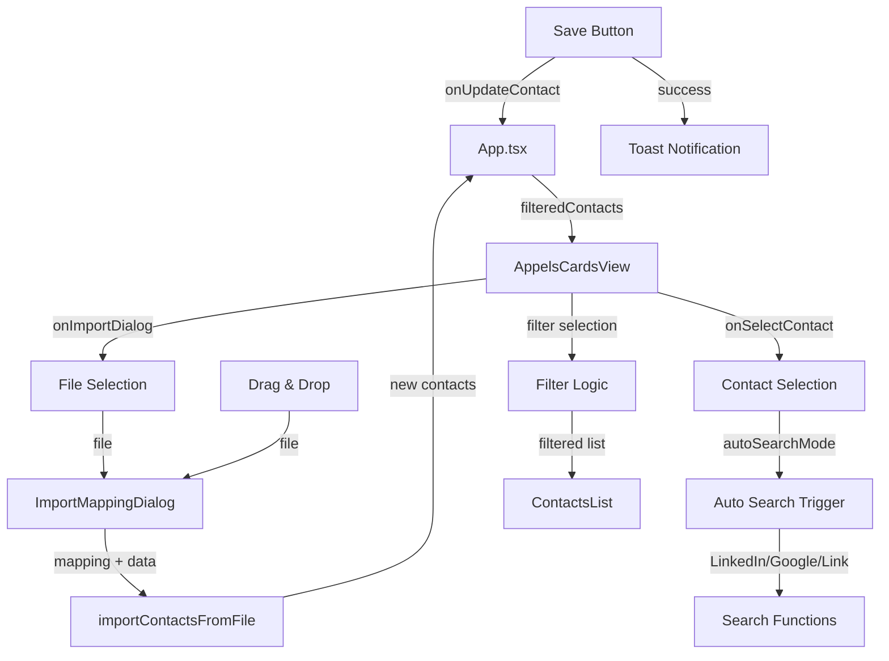

# Design Document - Alignement des fonctionnalités Appels 2

## Overview

Ce document décrit l'architecture et la conception technique pour implémenter les fonctionnalités manquantes dans la page "Appels 2" (AppelsCardsView). L'objectif est d'atteindre la parité fonctionnelle avec la page "Appels" originale tout en conservant l'interface moderne en cartes.

Toutes les nouvelles interfaces utiliseront les composants shadcn/ui via le MCP registry pour assurer la cohérence visuelle et l'accessibilité.

## Architecture

### Structure des composants

```
AppelsCardsView (composant principal)
├── Navbar (barre de navigation supérieure)
│   ├── SearchInput (recherche existante)
│   ├── AutoSearchDropdown (NOUVEAU - recherche automatique)
│   ├── FilterDropdown (existant - à rendre fonctionnel)
│   ├── ImportButton (existant - à connecter au mapping)
│   ├── ExportButton (existant)
│   └── DeleteButton (existant)
├── ContactsList (liste de cartes à gauche)
│   ├── ContactCard[] (cartes de contacts)
│   └── LoadMoreButton (existant)
├── ContactDetails (panneau de détails à droite)
│   ├── ContactHeader (en-tête avec avatar et actions)
│   ├── QuickSearchButtons (LinkedIn, Google, Lien - existants)
│   ├── ContactForm (formulaire d'édition)
│   │   ├── BasicInfoSection
│   │   │   ├── Input fields (existants)
│   │   │   └── NotesField + ZapWidget (NOUVEAU)
│   │   └── SchedulingSection
│   │       ├── DatePickerWithClear (NOUVEAU)
│   │       └── TimePickerWithClear (NOUVEAU)
│   └── CallHistorySection (existant)
├── ImportMappingDialog (NOUVEAU - réutilisation du composant existant)
├── DropZoneOverlay (NOUVEAU)
└── ImportProgressBar (NOUVEAU)
```

### Flux de données



## Components and Interfaces

### 1. AutoSearchDropdown (NOUVEAU)

Composant dropdown pour la recherche automatique avec mode persistant.

**Props:**
```typescript
interface AutoSearchDropdownProps {
  selectedContact: Contact | null
  onLinkedInSearch: () => void
  onGoogleSearch: () => void
  onDirectLink: () => void
  autoSearchMode: 'disabled' | 'linkedin' | 'google' | 'link'
  onAutoSearchModeChange: (mode: 'disabled' | 'linkedin' | 'google' | 'link') => void
}
```

**Composants shadcn/ui utilisés:**
- `DropdownMenu` (dropdown-menu)
- `DropdownMenuItem` (dropdown-menu)
- `DropdownMenuLabel` (dropdown-menu)
- `DropdownMenuSeparator` (dropdown-menu)
- `DropdownMenuRadioGroup` (dropdown-menu)
- `DropdownMenuRadioItem` (dropdown-menu)

**Structure:**
```tsx
<DropdownMenu>
  <DropdownMenuTrigger asChild>
    <Button variant="outline" size="icon">
      <Search className="h-4 w-4" />
    </Button>
  </DropdownMenuTrigger>
  <DropdownMenuContent align="end" className="w-56">
    <DropdownMenuLabel>Recherche rapide</DropdownMenuLabel>
    <DropdownMenuSeparator />
    <DropdownMenuItem onClick={onLinkedInSearch}>
      <Linkedin className="mr-2 h-4 w-4 text-blue-500" />
      LinkedIn
    </DropdownMenuItem>
    <DropdownMenuItem onClick={onGoogleSearch}>
      <Globe className="mr-2 h-4 w-4 text-green-500" />
      Google
    </DropdownMenuItem>
    <DropdownMenuItem onClick={onDirectLink} disabled={!selectedContact?.lien}>
      <ExternalLink className="mr-2 h-4 w-4 text-purple-500" />
      Lien direct
    </DropdownMenuItem>
    <DropdownMenuSeparator />
    <DropdownMenuLabel>Mode automatique</DropdownMenuLabel>
    <DropdownMenuRadioGroup value={autoSearchMode} onValueChange={onAutoSearchModeChange}>
      <DropdownMenuRadioItem value="disabled">
        <X className="mr-2 h-4 w-4" />
        Désactivé
      </DropdownMenuRadioItem>
      <DropdownMenuRadioItem value="linkedin">
        <Linkedin className="mr-2 h-4 w-4 text-blue-500" />
        LinkedIn
      </DropdownMenuRadioItem>
      <DropdownMenuRadioItem value="google">
        <Globe className="mr-2 h-4 w-4 text-green-500" />
        Google
      </DropdownMenuRadioItem>
      <DropdownMenuRadioItem value="link">
        <ExternalLink className="mr-2 h-4 w-4 text-purple-500" />
        Lien
      </DropdownMenuRadioItem>
    </DropdownMenuRadioGroup>
  </DropdownMenuContent>
</DropdownMenu>
```

**Logique de persistance:**
```typescript
// Sauvegarde dans localStorage
const AUTO_SEARCH_MODE_KEY = 'dimicall-auto-search-mode'

const saveAutoSearchMode = (mode: string) => {
  localStorage.setItem(AUTO_SEARCH_MODE_KEY, mode)
}

const loadAutoSearchMode = (): string => {
  return localStorage.getItem(AUTO_SEARCH_MODE_KEY) || 'disabled'
}

// Déclenchement automatique
useEffect(() => {
  if (!selectedContact || autoSearchMode === 'disabled') return
  
  switch (autoSearchMode) {
    case 'linkedin':
      onLinkedInSearch()
      break
    case 'google':
      onGoogleSearch()
      break
    case 'link':
      if (selectedContact.lien) onDirectLink()
      break
  }
}, [selectedContact?.id, autoSearchMode])
```

### 2. ZapWidget (NOUVEAU)

Widget pour insérer des commentaires rapides dans le champ Notes.

**Props:**
```typescript
interface ZapWidgetProps {
  value: string
  onChange: (newValue: string) => void
  quickComments: string[]
}
```

**Composants shadcn/ui utilisés:**
- `Select` (select)
- `SelectTrigger` (select)
- `SelectContent` (select)
- `SelectItem` (select)
- `Button` (button)

**Structure:**
```tsx
<div className="flex items-center gap-2">
  <Textarea
    value={value}
    onChange={(e) => onChange(e.target.value)}
    rows={4}
  />
  <Select onValueChange={(comment) => onChange(value ? `${value} ${comment}` : comment)}>
    <SelectTrigger asChild>
      <Button variant="ghost" size="icon" className="h-8 w-8">
        <Zap className="h-4 w-4" />
      </Button>
    </SelectTrigger>
    <SelectContent>
      {quickComments.map((comment) => (
        <SelectItem key={comment} value={comment}>
          {comment}
        </SelectItem>
      ))}
    </SelectContent>
  </Select>
</div>
```

### 3. DatePickerWithClear (NOUVEAU)

Composant de sélection de date avec bouton d'effacement.

**Props:**
```typescript
interface DatePickerWithClearProps {
  label: string
  value?: string
  onChange: (value: string) => void
  onClear: () => void
}
```

**Composants shadcn/ui utilisés:**
- `Popover` (popover)
- `PopoverTrigger` (popover)
- `PopoverContent` (popover)
- `Calendar` (calendar)
- `Button` (button)
- `Label` (label)

**Structure:**
```tsx
<div className="space-y-2">
  <Label>{label}</Label>
  <div className="flex items-center gap-2">
    <Popover>
      <PopoverTrigger asChild>
        <Button variant="outline" className="flex-1 justify-start">
          <CalendarIcon className="mr-2 h-4 w-4" />
          {value ? format(new Date(value), "dd MMM yyyy", { locale: fr }) : "Sélectionner"}
        </Button>
      </PopoverTrigger>
      <PopoverContent align="start">
        <Calendar
          mode="single"
          selected={value ? new Date(value) : undefined}
          onSelect={(date) => {
            if (date) onChange(format(date, "yyyy-MM-dd"))
          }}
        />
      </PopoverContent>
    </Popover>
    {value && (
      <Button
        variant="ghost"
        size="icon"
        onClick={onClear}
        className="h-10 w-10"
      >
        <X className="h-4 w-4" />
      </Button>
    )}
  </div>
</div>
```

### 4. TimePickerWithClear (NOUVEAU)

Composant de sélection d'heure avec bouton d'effacement.

**Props:**
```typescript
interface TimePickerWithClearProps {
  label: string
  value?: string
  onChange: (value: string) => void
  onClear: () => void
}
```

**Composants shadcn/ui utilisés:**
- `Select` (select)
- `SelectTrigger` (select)
- `SelectContent` (select)
- `SelectItem` (select)
- `ScrollArea` (scroll-area)
- `Button` (button)
- `Label` (label)

**Structure:**
```tsx
<div className="space-y-2">
  <Label>{label}</Label>
  <div className="flex items-center gap-2">
    <Select value={value || ""} onValueChange={onChange}>
      <SelectTrigger className="flex-1">
        <SelectValue placeholder="Sélectionner" />
      </SelectTrigger>
      <SelectContent>
        <ScrollArea className="h-60">
          {timeOptions.map((time) => (
            <SelectItem key={time} value={time}>
              {time}
            </SelectItem>
          ))}
        </ScrollArea>
      </SelectContent>
    </Select>
    {value && (
      <Button
        variant="ghost"
        size="icon"
        onClick={onClear}
        className="h-10 w-10"
      >
        <X className="h-4 w-4" />
      </Button>
    )}
  </div>
</div>
```

### 5. DropZoneOverlay (NOUVEAU)

Overlay pour le drag & drop de fichiers.

**Props:**
```typescript
interface DropZoneOverlayProps {
  isVisible: boolean
  isDragActive: boolean
}
```

**Composants shadcn/ui utilisés:**
- `Card` (card)

**Structure:**
```tsx
{isVisible && (
  <div className="fixed inset-0 z-50 flex items-center justify-center bg-background/80 backdrop-blur-sm">
    <Card className={cn(
      "border-2 border-dashed p-12 transition-colors",
      isDragActive ? "border-primary bg-primary/10" : "border-muted-foreground/25"
    )}>
      <div className="flex flex-col items-center gap-4">
        <Upload className="h-12 w-12 text-muted-foreground" />
        <div className="text-center">
          <p className="text-lg font-medium">
            {isDragActive ? "Déposez le fichier ici" : "Glissez un fichier pour l'importer"}
          </p>
          <p className="text-sm text-muted-foreground">
            Formats acceptés: .csv, .tsv, .xlsx, .xls
          </p>
        </div>
      </div>
    </Card>
  </div>
)}
```

### 6. ImportProgressBar (NOUVEAU)

Barre de progression pour l'import de fichiers.

**Props:**
```typescript
interface ImportProgressBarProps {
  progress: number
  message: string
  isVisible: boolean
}
```

**Composants shadcn/ui utilisés:**
- `Progress` (progress)
- `Card` (card)

**Structure:**
```tsx
{isVisible && (
  <Card className="fixed bottom-4 right-4 z-50 w-80 p-4 shadow-lg">
    <div className="space-y-2">
      <div className="flex items-center justify-between">
        <span className="text-sm font-medium">Import en cours...</span>
        <span className="text-sm text-muted-foreground">{progress}%</span>
      </div>
      <Progress value={progress} />
      <p className="text-xs text-muted-foreground">{message}</p>
    </div>
  </Card>
)}
```

## Data Models

### État local du composant AppelsCardsView

```typescript
interface AppelsCardsViewState {
  // Existant
  visibleCount: number
  filterOpen: boolean
  formState: FormState
  selectedStatus: ContactStatus
  isSaving: boolean
  noteDraft: string
  
  // NOUVEAU
  autoSearchMode: 'disabled' | 'linkedin' | 'google' | 'link'
  activeFilter: 'all' | 'rappel' | 'rdv' | 'status'
  isDragOver: boolean
  importProgress: { percentage: number; message: string } | null
  mappingDialog: {
    open: boolean
    file: File | null
    headers: string[]
    preview: string[][]
  }
}
```

### Filtres

```typescript
type FilterType = 'all' | 'rappel' | 'rdv' | 'status'

const applyFilter = (contacts: Contact[], filter: FilterType): Contact[] => {
  const today = format(new Date(), 'yyyy-MM-dd')
  
  switch (filter) {
    case 'rappel':
      return contacts.filter(c => c.dateRappel === today)
    case 'rdv':
      return contacts.filter(c => !!c.dateRDV)
    case 'status':
      return contacts.filter(c => !c.statut || c.statut === ContactStatus.NonDefini)
    default:
      return contacts
  }
}
```

## Error Handling

### Import de fichiers

```typescript
const handleFileImport = async (file: File) => {
  try {
    // Validation du type de fichier
    const validExtensions = ['.csv', '.tsv', '.xlsx', '.xls']
    const extension = file.name.substring(file.name.lastIndexOf('.'))
    
    if (!validExtensions.includes(extension.toLowerCase())) {
      toast.error('Format de fichier non supporté', {
        description: 'Veuillez utiliser un fichier .csv, .tsv, .xlsx ou .xls'
      })
      return
    }
    
    // Analyse du fichier
    const { headers, preview } = await analyzeFile(file)
    
    // Ouvrir le dialogue de mapping
    setMappingDialog({
      open: true,
      file,
      headers,
      preview
    })
    
  } catch (error) {
    console.error('Erreur lors de l\'import:', error)
    toast.error('Erreur d\'import', {
      description: error instanceof Error ? error.message : 'Une erreur est survenue'
    })
  }
}
```

### Recherche automatique

```typescript
const triggerAutoSearch = (contact: Contact, mode: string) => {
  try {
    switch (mode) {
      case 'linkedin':
        if (!contact.prenom && !contact.nom) {
          toast.warning('Informations manquantes', {
            description: 'Le contact doit avoir un prénom ou un nom'
          })
          return
        }
        onLinkedInSearch()
        break
        
      case 'google':
        if (!contact.prenom && !contact.nom) {
          toast.warning('Informations manquantes', {
            description: 'Le contact doit avoir un prénom ou un nom'
          })
          return
        }
        onGoogleSearch()
        break
        
      case 'link':
        if (!contact.lien) {
          toast.warning('Lien manquant', {
            description: 'Ce contact n\'a pas de lien direct'
          })
          return
        }
        onDirectLink()
        break
    }
  } catch (error) {
    console.error('Erreur lors de la recherche:', error)
    toast.error('Erreur de recherche')
  }
}
```

## Testing Strategy

### Tests unitaires

1. **AutoSearchDropdown**
   - Vérifier que le mode sélectionné est sauvegardé dans localStorage
   - Vérifier que le mode est restauré au chargement
   - Vérifier que la recherche automatique se déclenche lors du changement de contact
   - Vérifier que le lien direct est désactivé quand aucun lien n'existe

2. **ZapWidget**
   - Vérifier que les commentaires rapides sont ajoutés au texte existant
   - Vérifier que les commentaires sont séparés par des espaces
   - Vérifier que les modifications manuelles sont conservées

3. **DatePickerWithClear / TimePickerWithClear**
   - Vérifier que le bouton X apparaît uniquement quand une valeur est sélectionnée
   - Vérifier que cliquer sur X efface la valeur
   - Vérifier que la valeur est formatée correctement

4. **Filtres**
   - Vérifier que chaque filtre retourne les bons contacts
   - Vérifier que le filtre "rappel" compare correctement les dates
   - Vérifier que le filtre "rdv" vérifie l'existence de la date
   - Vérifier que le filtre "status" identifie les statuts non définis

### Tests d'intégration

1. **Import avec mapping**
   - Tester l'import d'un fichier CSV avec mapping automatique
   - Tester l'import d'un fichier Excel avec mapping manuel
   - Tester le rejet de fichiers invalides
   - Tester l'affichage de la progression

2. **Drag & Drop**
   - Tester le glisser-déposer d'un fichier valide
   - Tester le glisser-déposer d'un fichier invalide
   - Tester l'affichage de l'overlay

3. **Recherche automatique**
   - Tester le déclenchement automatique lors du changement de contact
   - Tester la désactivation du mode automatique
   - Tester la gestion des contacts sans informations

### Tests manuels

1. Vérifier que tous les composants shadcn/ui sont correctement stylés
2. Vérifier la responsivité sur différentes tailles d'écran
3. Vérifier l'accessibilité au clavier
4. Vérifier les animations et transitions
5. Vérifier la cohérence visuelle avec le reste de l'application

## Performance Considerations

### Optimisations

1. **Filtrage des contacts**
   - Utiliser `useMemo` pour mémoriser les résultats de filtrage
   - Éviter de recalculer les filtres à chaque render

2. **Recherche automatique**
   - Debounce le déclenchement automatique pour éviter les appels multiples
   - Utiliser `useEffect` avec dépendances précises

3. **Import de fichiers**
   - Traiter les fichiers par chunks pour les gros imports
   - Afficher la progression en temps réel
   - Utiliser des Web Workers si nécessaire pour les fichiers très volumineux

4. **Scroll automatique**
   - Utiliser `scrollIntoView` avec `behavior: 'smooth'`
   - Vérifier si le contact est déjà visible avant de scroller
   - Utiliser `requestAnimationFrame` pour optimiser les animations

## Implementation Notes

### Ordre d'implémentation recommandé

1. **Phase 1: Composants de base**
   - DatePickerWithClear
   - TimePickerWithClear
   - ZapWidget

2. **Phase 2: Recherche et filtres**
   - AutoSearchDropdown
   - Logique de filtrage fonctionnelle

3. **Phase 3: Import**
   - Intégration ImportMappingDialog
   - DropZoneOverlay
   - ImportProgressBar

4. **Phase 4: Améliorations UX**
   - Scroll automatique
   - Toast notifications
   - Persistance des préférences

### Dépendances externes

- `date-fns` (déjà installé) - pour le formatage des dates
- `sonner` (déjà installé) - pour les toast notifications
- `lucide-react` (déjà installé) - pour les icônes
- shadcn/ui components via MCP registry

### Compatibilité

- Tous les composants doivent supporter le thème dark/light
- Tous les composants doivent être accessibles au clavier
- Tous les composants doivent être responsifs
- Tous les composants doivent utiliser les tokens de design existants
