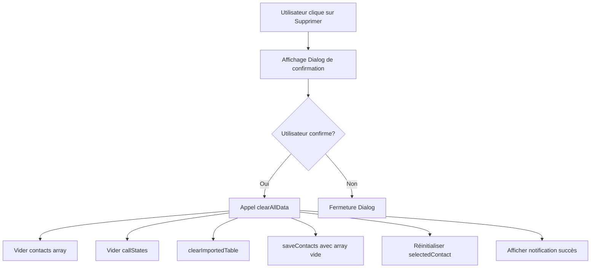

# Design Document

## Overview

Cette fonctionnalité ajoute un bouton "Supprimer" dans la section "Données" de l'interface utilisateur, permettant aux utilisateurs de vider complètement la table des contacts. Le bouton suit le même design pattern que les boutons "Importer" et "Export" existants et inclut une boîte de dialogue de confirmation pour éviter les suppressions accidentelles.

## Architecture

### Composants Impliqués

1. **App.tsx** - Composant principal contenant la logique de gestion des contacts
2. **dataService.ts** - Service contenant les fonctions de gestion des données
3. **Dialog Components** - Composants UI pour la boîte de dialogue de confirmation

### Flux de Données



## Components and Interfaces

### 1. Nouveau Bouton dans la Section Données

**Localisation**: Dans App.tsx, dans la section des boutons ribbon existante

**Structure HTML**:
```tsx
<button 
  className="ribbon-button-modern relative overflow-hidden transition-all duration-300 ease-out hover:scale-105 hover:shadow-lg hover:shadow-primary/20 group cursor-pointer border border-transparent hover:bg-gradient-to-br hover:from-primary/10 hover:to-accent/10 hover:border-primary/30 hover:transform hover:rotate-1 min-w-[80px] max-w-[80px] h-12"
  onClick={handleClearData}
>
  {/* Effets visuels identiques aux autres boutons */}
  <div className="absolute inset-0 opacity-0 group-hover:opacity-100 transition-opacity duration-500">
    <div className="absolute inset-0 bg-gradient-to-r from-transparent via-white/10 to-transparent -translate-x-full group-hover:translate-x-full transition-transform duration-1000 ease-out"></div>
  </div>
  <div className="absolute inset-0 opacity-0 group-hover:opacity-100 transition-opacity duration-300 bg-gradient-radial from-primary/20 via-transparent to-transparent blur-xl"></div>
  
  {/* Contenu du bouton */}
  <div className="relative z-10 flex flex-col items-center justify-center h-full w-full">
    <div className="w-4 h-4 mb-1 transition-all duration-300 group-hover:scale-110 group-hover:rotate-12 flex items-center justify-center [&>svg]:w-4 [&>svg]:h-4">
      <Trash2 />
    </div>
    <span className="text-[10px] leading-tight w-full transition-all duration-300 group-hover:font-semibold text-center">Supprimer</span>
  </div>
</button>
```

### 2. Boîte de Dialogue de Confirmation

**Composant**: Utilisation des composants Dialog existants de shadcn/ui

**Structure**:
```tsx
<Dialog open={isClearDataDialogOpen} onOpenChange={setIsClearDataDialogOpen}>
  <DialogContent className="sm:max-w-[425px]">
    <DialogHeader>
      <DialogTitle>Supprimer toutes les données</DialogTitle>
      <DialogDescription>
        Cette action supprimera définitivement tous les contacts importés dans la table. 
        Cette action ne peut pas être annulée.
      </DialogDescription>
    </DialogHeader>
    <DialogFooter>
      <Button variant="outline" onClick={() => setIsClearDataDialogOpen(false)}>
        Annuler
      </Button>
      <Button variant="destructive" onClick={confirmClearData}>
        Supprimer tout
      </Button>
    </DialogFooter>
  </DialogContent>
</Dialog>
```

### 3. États et Handlers

**Nouveaux états requis**:
```tsx
const [isClearDataDialogOpen, setIsClearDataDialogOpen] = useState(false);
```

**Handlers requis**:
```tsx
const handleClearData = useCallback(() => {
  setIsClearDataDialogOpen(true);
}, []);

const confirmClearData = useCallback(() => {
  // Logique de suppression
  clearAllData();
  setIsClearDataDialogOpen(false);
}, []);
```

## Data Models

### Fonction clearAllData

**Localisation**: App.tsx (fonction interne) ou dataService.ts (fonction exportée)

**Signature**:
```tsx
const clearAllData = useCallback(() => {
  // 1. Vider la liste des contacts
  setContacts([]);
  
  // 2. Vider les états d'appel
  setCallStates({});
  
  // 3. Désélectionner le contact actuel
  setSelectedContact(null);
  
  // 4. Réinitialiser l'appel actif si nécessaire
  if (activeCallContactId) {
    setActiveCallContactId(null);
    setCallStartTime(null);
  }
  
  // 5. Nettoyer le localStorage
  saveContacts([]);
  saveCallStates({});
  clearImportedTable();
  
  // 6. Notification de succès
  showNotification('success', 'Toutes les données ont été supprimées avec succès');
}, [activeCallContactId, showNotification]);
```

### Intégration avec les Services Existants

**Services utilisés**:
- `saveContacts([])` - Sauvegarder un tableau vide
- `saveCallStates({})` - Sauvegarder des états vides
- `clearImportedTable()` - Nettoyer la table importée (fonction existante)

## Error Handling

### Gestion des Erreurs

1. **Erreur de localStorage**: Si la sauvegarde échoue, afficher une notification d'erreur
2. **État incohérent**: Vérifier que tous les états sont correctement réinitialisés
3. **Appel en cours**: Gérer le cas où un appel est en cours lors de la suppression

```tsx
const clearAllData = useCallback(() => {
  try {
    // Logique de suppression...
    showNotification('success', 'Toutes les données ont été supprimées avec succès');
  } catch (error) {
    console.error('Erreur lors de la suppression des données:', error);
    showNotification('error', 'Erreur lors de la suppression des données');
  }
}, []);
```

## Testing Strategy

### Tests Unitaires

1. **Test du bouton**: Vérifier que le bouton s'affiche correctement avec les bonnes classes CSS
2. **Test du handler**: Vérifier que `handleClearData` ouvre la boîte de dialogue
3. **Test de confirmation**: Vérifier que `confirmClearData` vide correctement toutes les données
4. **Test d'annulation**: Vérifier que l'annulation ferme la boîte de dialogue sans supprimer

### Tests d'Intégration

1. **Test complet du flux**: Cliquer sur le bouton → Confirmer → Vérifier que les données sont supprimées
2. **Test de persistance**: Vérifier que les données restent supprimées après rechargement
3. **Test d'état**: Vérifier que tous les états de l'application sont correctement réinitialisés

### Tests Visuels

1. **Cohérence visuelle**: Vérifier que le bouton a le même style que les autres
2. **Responsive**: Vérifier que le bouton s'affiche correctement sur différentes tailles d'écran
3. **Accessibilité**: Vérifier que le bouton est accessible au clavier et aux lecteurs d'écran

## Implementation Notes

### Icône Recommandée

Utiliser l'icône `Trash2` de Lucide React pour maintenir la cohérence avec les autres icônes de l'application.

### Position du Bouton

Le bouton doit être placé après le bouton "Export" dans la section "Données" pour suivre l'ordre logique : Importer → Export → Supprimer.

### Couleur et Style

Le bouton utilise les mêmes classes que les autres boutons mais pourrait avoir une variante légèrement différente au survol pour indiquer son caractère destructif (optionnel).

### Performance

La suppression des données étant une opération synchrone et légère, aucune optimisation particulière n'est nécessaire. Cependant, il faut s'assurer que la fonction `clearImportedTable()` gère correctement les gros volumes de données.