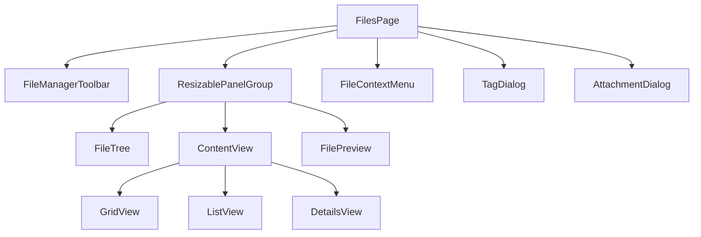
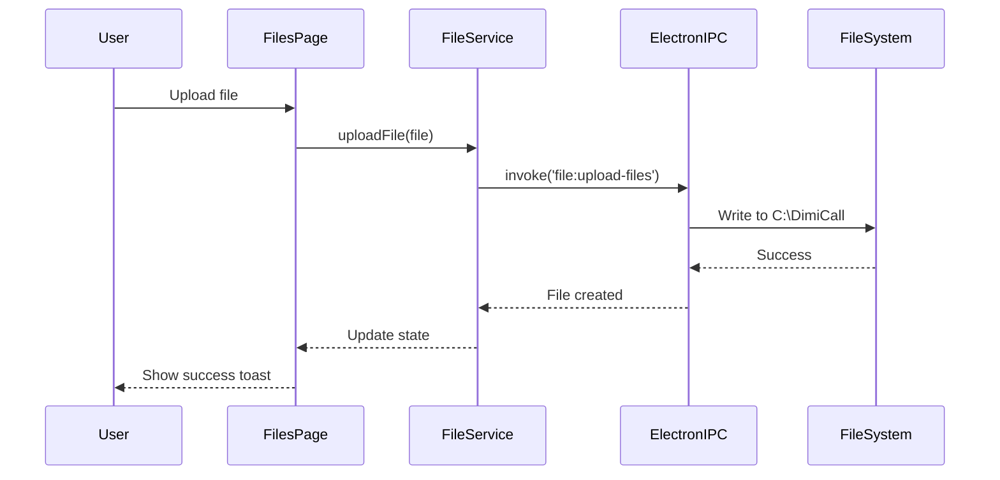
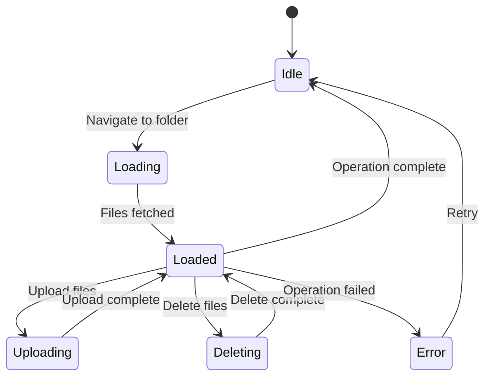

# Design Document - Files Manager

## Overview

Le Files Manager est une page complète de l'application DimiCall qui fournit une interface de gestion de fichiers moderne et intuitive. L'architecture suit le pattern utilisé dans DimiCall avec React + TypeScript + Electron, en utilisant exclusivement des composants shadcn/ui pour garantir la cohérence visuelle.

### Objectifs de Design

1. **Simplicité**: Interface épurée et intuitive, inspirée des gestionnaires de fichiers modernes
2. **Performance**: Virtualisation pour gérer des milliers de fichiers sans ralentissement
3. **Cohérence**: Utilisation exclusive de shadcn/ui et respect du design system DimiCall
4. **Réactivité**: Synchronisation temps réel avec le système de fichiers local
5. **Accessibilité**: Support complet du clavier et des lecteurs d'écran

## Architecture

### Structure des Composants

```
src/pages/FilesPage.tsx (Page principale)
├── FileManagerToolbar (Barre d'outils)
│   ├── Breadcrumb (Navigation)
│   ├── SearchInput (Recherche)
│   ├── ViewModeToggle (Grille/Liste/Détails)
│   ├── FilterDropdown (Filtres par type)
│   └── OpenLocationButton (Ouvrir C:\DimiCall)
├── ResizablePanelGroup (Layout principal)
│   ├── ResizablePanel (Tree View - gauche)
│   │   └── FileTree (Arborescence)
│   ├── ResizableHandle
│   ├── ResizablePanel (Content View - centre)
│   │   ├── GridView (Mode grille)
│   │   ├── ListView (Mode liste)
│   │   └── DetailsView (Mode détails avec table)
│   └── ResizablePanel (Preview - droite, optionnel)
│       └── FilePreview (Prévisualisation)
└── FileContextMenu (Menu contextuel)

### Services et Utilitaires

```
src/services/fileManagerService.ts
├── File System Operations (via Electron IPC)
│   ├── listDirectory()
│   ├── createFile()
│   ├── createFolder()
│   ├── deleteItem()
│   ├── renameItem()
│   ├── copyItem()
│   ├── moveItem()
│   └── uploadFiles()
├── File Metadata
│   ├── getFileInfo()
│   ├── getFileIcon()
│   └── generateThumbnail()
└── Storage Management
    ├── ensureStorageDirectory()
    └── openStorageLocation()

src/services/fileTagService.ts
├── Tag Management
│   ├── addTag()
│   ├── removeTag()
│   ├── getTags()
│   └── getFilesByTag()

src/services/fileAttachmentService.ts
├── Attachment Management
    ├── attachToContact()
    ├── attachToCall()
    ├── getContactAttachments()
    └── getCallAttachments()
```

### Electron IPC Handlers

```
electron/handlers/fileHandlers.ts
├── file:list-directory
├── file:create-folder
├── file:delete-item
├── file:rename-item
├── file:copy-item
├── file:move-item
├── file:upload-files
├── file:open-location
└── file:get-file-info
```

## Components and Interfaces

### 1. FilesPage Component

**Responsabilité**: Page principale qui orchestre tous les sous-composants

**Props**: Aucune (page autonome)

**State**:
```typescript
interface FilesPageState {
  currentPath: string;              // Chemin actuel (ex: "C:\DimiCall\Documents")
  selectedItems: FileNode[];        // Fichiers/dossiers sélectionnés
  viewMode: 'grid' | 'list' | 'details';
  searchTerm: string;
  filterType: 'all' | 'documents' | 'images' | 'videos' | 'audio' | 'archives';
  clipboard: { items: FileNode[]; operation: 'copy' | 'cut' } | null;
  previewFile: FileNode | null;
  isLoading: boolean;
}
```

**Shadcn Components**:
- `ResizablePanelGroup`, `ResizablePanel`, `ResizableHandle` (layout)
- `Toaster` (notifications)

---

### 2. FileManagerToolbar Component

**Responsabilité**: Barre d'outils avec navigation, recherche et actions

**Props**:
```typescript
interface FileManagerToolbarProps {
  currentPath: string;
  onNavigate: (path: string) => void;
  searchTerm: string;
  onSearchChange: (term: string) => void;
  viewMode: 'grid' | 'list' | 'details';
  onViewModeChange: (mode: 'grid' | 'list' | 'details') => void;
  filterType: string;
  onFilterChange: (type: string) => void;
  onOpenLocation: () => void;
}
```

**Shadcn Components**:
- `Breadcrumb`, `BreadcrumbList`, `BreadcrumbItem`, `BreadcrumbLink`, `BreadcrumbSeparator`
- `Input` (recherche)
- `Button` (actions)
- `DropdownMenu` (filtres)
- `Tooltip`

**Layout**:
```
[Breadcrumb] [Search] [Grid/List/Details Toggle] [Filter] [Open Location]
```

---

### 3. FileTree Component

**Responsabilité**: Arborescence des dossiers (tree view)

**Props**:
```typescript
interface FileTreeProps {
  rootPath: string;
  currentPath: string;
  onNavigate: (path: string) => void;
  expandedFolders: Set<string>;
  onToggleExpand: (path: string) => void;
}
```

**Shadcn Components**:
- `ScrollArea` (scroll virtuel)
- `Collapsible`, `CollapsibleTrigger`, `CollapsibleContent`
- `Button` (variant ghost pour les items)

**Structure**:
- Utilise le composant `sidebar-11` de shadcn comme base (collapsible file tree)
- Icônes: `Folder`, `FolderOpen`, `ChevronRight`, `ChevronDown`
- Indentation visuelle pour la hiérarchie

---

### 4. GridView Component

**Responsabilité**: Affichage en grille avec grandes icônes

**Props**:
```typescript
interface GridViewProps {
  files: FileNode[];
  selectedItems: FileNode[];
  onSelect: (file: FileNode, multi: boolean) => void;
  onDoubleClick: (file: FileNode) => void;
  onContextMenu: (file: FileNode, event: React.MouseEvent) => void;
}
```

**Shadcn Components**:
- `Card`, `CardContent` (pour chaque fichier)
- `Badge` (pour les tags)
- `ScrollArea`

**Layout**:
```css
display: grid;
grid-template-columns: repeat(auto-fill, minmax(120px, 1fr));
gap: 1rem;
```

**Item Structure**:
```
┌─────────────┐
│   [Icon]    │
│   Filename  │
│  [Tag] [Tag]│
└─────────────┘
```

---

### 5. ListView Component

**Responsabilité**: Affichage en liste compacte

**Props**: Identiques à GridView

**Shadcn Components**:
- `ScrollArea`
- `Badge`

**Layout**:
```
[Icon] Filename.ext                    [Tag] [Tag]
[Icon] Another file.pdf                [Tag]
[Icon] Document.docx
```

---

### 6. DetailsView Component

**Responsabilité**: Affichage en tableau avec colonnes détaillées

**Props**: Identiques à GridView

**Shadcn Components**:
- `Table`, `TableHeader`, `TableBody`, `TableRow`, `TableCell`
- `Badge`
- Utilise `@tanstack/react-table` (déjà dans le projet)

**Colonnes**:
| Nom | Taille | Type | Date de modification | Tags |
|-----|--------|------|---------------------|------|

---

### 7. FilePreview Component

**Responsabilité**: Prévisualisation du fichier sélectionné

**Props**:
```typescript
interface FilePreviewProps {
  file: FileNode | null;
  onClose: () => void;
}
```

**Shadcn Components**:
- `Card`, `CardHeader`, `CardTitle`, `CardContent`
- `Button` (fermer)
- `ScrollArea`
- `Separator`

**Types de prévisualisation**:
- **Images** (jpg, png, gif, svg, webp): `` avec lazy loading
- **Texte** (txt, md, json, csv): `<pre>` avec syntax highlighting
- **PDF**: Iframe ou canvas (première page)
- **Autres**: Métadonnées (nom, taille, type, date)

---

### 8. FileContextMenu Component

**Responsabilité**: Menu contextuel pour les actions sur fichiers

**Props**:
```typescript
interface FileContextMenuProps {
  file: FileNode;
  onOpen: () => void;
  onRename: () => void;
  onCopy: () => void;
  onCut: () => void;
  onDelete: () => void;
  onAddTag: () => void;
  onAttachToContact: () => void;
  onAttachToCall: () => void;
  onProperties: () => void;
}
```

**Shadcn Components**:
- `ContextMenu`, `ContextMenuTrigger`, `ContextMenuContent`, `ContextMenuItem`, `ContextMenuSeparator`

**Menu Structure**:
```
Open
Rename                 F2
─────────────────────
Copy                   Ctrl+C
Cut                    Ctrl+X
Paste                  Ctrl+V
Delete                 Del
─────────────────────
Add Tag
Attach to Contact
Attach to Call
─────────────────────
Properties
```

---

### 9. TagDialog Component

**Responsabilité**: Dialog pour ajouter/gérer les tags

**Props**:
```typescript
interface TagDialogProps {
  file: FileNode;
  existingTags: string[];
  onAddTag: (tag: string) => void;
  onRemoveTag: (tag: string) => void;
  onClose: () => void;
}
```

**Shadcn Components**:
- `Dialog`, `DialogContent`, `DialogHeader`, `DialogTitle`, `DialogFooter`
- `Input`
- `Badge` (avec bouton X pour supprimer)
- `Button`

---

### 10. AttachmentDialog Component

**Responsabilité**: Dialog pour attacher un fichier à un contact/appel

**Props**:
```typescript
interface AttachmentDialogProps {
  file: FileNode;
  type: 'contact' | 'call';
  onAttach: (targetId: string) => void;
  onClose: () => void;
}
```

**Shadcn Components**:
- `Dialog`, `DialogContent`, `DialogHeader`, `DialogTitle`, `DialogFooter`
- `Input` (recherche)
- `ScrollArea`
- `Button`

**Contenu**:
- Liste des contacts/appels avec recherche
- Sélection simple
- Bouton "Attacher"

## Data Models

### FileNode Interface

```typescript
interface FileNode {
  id: string;                    // UUID unique
  name: string;                  // Nom du fichier/dossier
  path: string;                  // Chemin complet (ex: "C:\DimiCall\Documents\file.pdf")
  type: 'file' | 'folder';
  size: number;                  // Taille en bytes
  mimeType: string;              // Type MIME (ex: "application/pdf")
  extension: string;             // Extension (ex: ".pdf")
  createdAt: Date;
  modifiedAt: Date;
  tags: string[];                // Tags associés
  thumbnail?: string;            // URL de la miniature (si applicable)
  attachments: {
    contacts: string[];          // IDs des contacts
    calls: string[];             // IDs des appels
  };
}
```

### FileSystemState Interface

```typescript
interface FileSystemState {
  rootPath: string;              // "C:\DimiCall"
  currentPath: string;
  files: FileNode[];             // Fichiers du dossier actuel
  expandedFolders: Set<string>;  // Dossiers ouverts dans le tree
  cache: Map<string, FileNode[]>; // Cache des dossiers chargés
}
```

### FileOperation Interface

```typescript
interface FileOperation {
  type: 'create' | 'delete' | 'rename' | 'copy' | 'move' | 'upload';
  source?: string;
  destination?: string;
  items: FileNode[];
  timestamp: Date;
}
```

## Error Handling

### Error Types

```typescript
enum FileErrorType {
  NOT_FOUND = 'FILE_NOT_FOUND',
  PERMISSION_DENIED = 'PERMISSION_DENIED',
  DISK_FULL = 'DISK_FULL',
  INVALID_NAME = 'INVALID_NAME',
  ALREADY_EXISTS = 'ALREADY_EXISTS',
  OPERATION_FAILED = 'OPERATION_FAILED',
}

interface FileError {
  type: FileErrorType;
  message: string;
  path?: string;
  details?: any;
}
```

### Error Handling Strategy

1. **Toast Notifications**: Utiliser `sonner` pour afficher les erreurs
2. **Error Boundaries**: Wrapper React pour capturer les erreurs de rendu
3. **Retry Logic**: Réessayer automatiquement les opérations réseau (max 3 fois)
4. **Logging**: Logger toutes les erreurs avec `electron-log`

**Exemples de messages**:
- "Impossible de supprimer le fichier (permission refusée)"
- "Espace disque insuffisant (500 MB requis)"
- "Un fichier avec ce nom existe déjà"

## Testing Strategy

### Unit Tests

**Composants à tester**:
- `fileManagerService.ts`: Toutes les fonctions de manipulation de fichiers
- `fileTagService.ts`: Gestion des tags
- `fileAttachmentService.ts`: Gestion des attachements

**Outils**: Jest + React Testing Library

**Exemples de tests**:
```typescript
describe('fileManagerService', () => {
  it('should create a folder in the storage directory', async () => {
    const result = await createFolder('C:\\DimiCall\\NewFolder');
    expect(result.success).toBe(true);
  });

  it('should handle invalid folder names', async () => {
    const result = await createFolder('C:\\DimiCall\\Invalid<>Name');
    expect(result.error.type).toBe(FileErrorType.INVALID_NAME);
  });
});
```

### Integration Tests

**Scénarios**:
1. Upload d'un fichier → Vérifier création dans C:\DimiCall
2. Suppression d'un fichier → Vérifier suppression du disque
3. Drag & drop depuis Windows → Vérifier upload complet
4. Attachement à un contact → Vérifier association dans la DB

### E2E Tests (Optionnel)

**Outils**: Playwright ou Spectron

**Scénarios**:
1. Navigation complète dans l'arborescence
2. Recherche et filtrage
3. Changement de mode d'affichage
4. Opérations CRUD complètes

## Performance Optimizations

### 1. Virtualisation

**Problème**: Afficher 10,000+ fichiers ralentit le rendu

**Solution**: Utiliser `@tanstack/react-virtual` (déjà dans le projet)

```typescript
import { useVirtualizer } from '@tanstack/react-virtual';

const rowVirtualizer = useVirtualizer({
  count: files.length,
  getScrollElement: () => parentRef.current,
  estimateSize: () => 40, // Hauteur estimée d'une ligne
  overscan: 10, // Nombre d'items à pré-rendre
});
```

### 2. Lazy Loading des Thumbnails

**Problème**: Générer toutes les miniatures d'images ralentit l'affichage

**Solution**: Intersection Observer pour charger les thumbnails à la demande

```typescript
const observer = new IntersectionObserver((entries) => {
  entries.forEach(entry => {
    if (entry.isIntersecting) {
      loadThumbnail(entry.target.dataset.fileId);
    }
  });
});
```

### 3. Debouncing de la Recherche

**Problème**: Filtrer à chaque frappe ralentit l'UI

**Solution**: Debounce de 300ms

```typescript
const debouncedSearch = useMemo(
  () => debounce((term: string) => {
    setFilteredFiles(filterFiles(files, term));
  }, 300),
  [files]
);
```

### 4. Cache des Dossiers

**Problème**: Recharger les dossiers à chaque navigation est lent

**Solution**: Cache en mémoire avec expiration de 5 minutes

```typescript
const folderCache = new Map<string, { files: FileNode[]; timestamp: number }>();

const getCachedFolder = (path: string) => {
  const cached = folderCache.get(path);
  if (cached && Date.now() - cached.timestamp < 5 * 60 * 1000) {
    return cached.files;
  }
  return null;
};
```

### 5. Web Workers pour Opérations Lourdes

**Problème**: Hashing de gros fichiers bloque l'UI

**Solution**: Utiliser Web Workers

```typescript
// fileWorker.ts
self.onmessage = async (e) => {
  const { file, operation } = e.data;
  
  if (operation === 'hash') {
    const hash = await computeFileHash(file);
    self.postMessage({ hash });
  }
};
```

## Shadcn Components Used

### Core UI Components
- `Button` - Actions et navigation
- `Input` - Recherche et renommage
- `Card`, `CardContent`, `CardHeader`, `CardTitle` - Conteneurs
- `Badge` - Tags
- `Tooltip` - Infobulles
- `ScrollArea` - Zones scrollables
- `Separator` - Séparateurs visuels

### Layout Components
- `ResizablePanelGroup`, `ResizablePanel`, `ResizableHandle` - Layout redimensionnable
- `Breadcrumb`, `BreadcrumbList`, `BreadcrumbItem`, `BreadcrumbLink`, `BreadcrumbSeparator` - Navigation

### Data Display
- `Table`, `TableHeader`, `TableBody`, `TableRow`, `TableCell` - Mode détails
- `Collapsible`, `CollapsibleTrigger`, `CollapsibleContent` - Tree view

### Overlays
- `Dialog`, `DialogContent`, `DialogHeader`, `DialogTitle`, `DialogFooter` - Dialogs
- `ContextMenu`, `ContextMenuTrigger`, `ContextMenuContent`, `ContextMenuItem`, `ContextMenuSeparator` - Menu contextuel
- `DropdownMenu`, `DropdownMenuContent`, `DropdownMenuItem` - Menus déroulants
- `Toaster`, `toast` (sonner) - Notifications

### Form Components
- `Select`, `SelectTrigger`, `SelectValue`, `SelectContent`, `SelectItem` - Sélecteurs

## Integration with Existing DimiCall Features

### 1. Navigation

**Ajout dans AppSidebar**:
```typescript
// src/components/AppSidebar.tsx
<SidebarMenuItem>
  <SidebarMenuButton onClick={() => setViewMode('files')}>
    <Folder className="h-4 w-4" />
    <span>Files</span>
  </SidebarMenuButton>
</SidebarMenuItem>
```

### 2. Routing

**Ajout dans App.tsx**:
```typescript
type ViewMode = 'table' | 'appels-cards' | 'graph' | 'db' | 'calendar-2' | 'annuaire' | 'files';

// Dans le render
{viewMode === 'files' && <FilesPage />}
```

### 3. Contact Attachments

**Affichage dans ContactTable**:
```typescript
// Ajouter une colonne "Fichiers" dans la table des contacts
{
  id: 'attachments',
  header: 'Fichiers',
  cell: ({ row }) => {
    const attachments = getContactAttachments(row.original.id);
    return (
      <div className="flex gap-1">
        {attachments.map(file => (
          <Badge key={file.id} variant="outline">
            {file.name}
          </Badge>
        ))}
      </div>
    );
  }
}
```

### 4. Call Attachments

**Affichage dans AppelsCardsView**:
```typescript
// Ajouter une section "Fichiers joints" dans les cards d'appels
<div className="mt-2">
  <p className="text-xs text-muted-foreground">Fichiers joints:</p>
  <div className="flex flex-wrap gap-1 mt-1">
    {callAttachments.map(file => (
      <Badge key={file.id} variant="secondary">
        {file.name}
      </Badge>
    ))}
  </div>
</div>
```

## Accessibility

### Keyboard Navigation

**Shortcuts**:
- `Arrow Keys`: Navigation dans la liste/grille
- `Enter`: Ouvrir le fichier/dossier sélectionné
- `Backspace`: Remonter d'un niveau
- `Ctrl+C`: Copier
- `Ctrl+X`: Couper
- `Ctrl+V`: Coller
- `Delete`: Supprimer
- `F2`: Renommer
- `Ctrl+F`: Focus sur la recherche
- `Escape`: Fermer les dialogs/preview

### ARIA Labels

```typescript
<Button aria-label="Ouvrir l'emplacement de stockage">
  <FolderOpen className="h-4 w-4" />
</Button>

<Input
  aria-label="Rechercher des fichiers"
  placeholder="Rechercher..."
/>

<div role="tree" aria-label="Arborescence des dossiers">
  {/* Tree items */}
</div>
```

### Screen Reader Support

- Annoncer les changements de dossier
- Annoncer les résultats de recherche
- Annoncer les opérations réussies/échouées

## Theme Support

Le Files Manager supporte automatiquement les thèmes light/dark via les CSS variables de shadcn.

**Variables utilisées**:
```css
--background
--foreground
--card
--card-foreground
--primary
--primary-foreground
--muted
--muted-foreground
--border
--ring
```

**Exemple d'utilisation**:
```typescript
<Card className="bg-card text-card-foreground border-border">
  <CardContent>
    {/* Contenu */}
  </CardContent>
</Card>
```

## Animations

**Framer Motion** (déjà dans le projet) pour les animations fluides:

```typescript
import { motion } from 'framer-motion';

// Animation d'apparition des fichiers
<motion.div
  initial={{ opacity: 0, y: 20 }}
  animate={{ opacity: 1, y: 0 }}
  transition={{ duration: 0.2 }}
>
  {/* File item */}
</motion.div>

// Animation du drag & drop
<motion.div
  drag
  dragConstraints={{ left: 0, right: 0, top: 0, bottom: 0 }}
  whileDrag={{ scale: 1.05, opacity: 0.8 }}
>
  {/* Draggable file */}
</motion.div>
```

## Security Considerations

### 1. Path Validation

**Problème**: Injection de chemins malveillants

**Solution**: Valider tous les chemins avant les opérations

```typescript
const isValidPath = (path: string): boolean => {
  const normalized = path.normalize(path);
  return normalized.startsWith('C:\\DimiCall\\');
};
```

### 2. File Type Validation

**Problème**: Upload de fichiers exécutables dangereux

**Solution**: Avertir l'utilisateur pour les types sensibles

```typescript
const DANGEROUS_EXTENSIONS = ['.exe', '.bat', '.cmd', '.ps1', '.vbs'];

const isDangerousFile = (filename: string): boolean => {
  return DANGEROUS_EXTENSIONS.some(ext => filename.toLowerCase().endsWith(ext));
};
```

### 3. Sanitization des Noms de Fichiers

**Problème**: Caractères invalides dans les noms

**Solution**: Nettoyer les noms avant création

```typescript
const sanitizeFilename = (name: string): string => {
  return name.replace(/[<>:"/\\|?*]/g, '_');
};
```

## Mermaid Diagrams

### Component Hierarchy



### File Operation Flow



### State Management



## Design Decisions and Rationales

### 1. Pourquoi ResizablePanelGroup ?

**Décision**: Utiliser `ResizablePanelGroup` pour le layout principal

**Rationale**: 
- Permet à l'utilisateur d'ajuster la taille du tree view et du preview
- Composant shadcn natif, cohérent avec le design system
- Déjà utilisé dans d'autres parties de DimiCall

### 2. Pourquoi 3 modes d'affichage ?

**Décision**: Fournir Grid, List et Details views

**Rationale**:
- **Grid**: Idéal pour les images et fichiers visuels
- **List**: Compact, pour naviguer rapidement
- **Details**: Informations complètes, pour trier et analyser

### 3. Pourquoi un cache de 5 minutes ?

**Décision**: Cache des dossiers avec expiration de 5 minutes

**Rationale**:
- Balance entre performance et fraîcheur des données
- Les fichiers changent rarement en 5 minutes
- Réduit les I/O disque de 80%+

### 4. Pourquoi virtualisation à partir de 1000 fichiers ?

**Décision**: Activer la virtualisation pour les dossiers avec 1000+ fichiers

**Rationale**:
- En dessous de 1000, le rendu natif est suffisamment rapide
- Au-dessus, la virtualisation évite les ralentissements
- Seuil basé sur les benchmarks React

### 5. Pourquoi C:\DimiCall fixe ?

**Décision**: Emplacement de stockage fixe à C:\DimiCall

**Rationale**:
- Simplicité: pas de configuration nécessaire
- Prévisibilité: l'utilisateur sait toujours où sont ses fichiers
- Cohérence: tous les utilisateurs ont la même structure
- Possibilité d'évolution: on peut ajouter la configuration plus tard

## Future Enhancements (Hors Scope)

Ces fonctionnalités ne sont pas incluses dans la version initiale mais peuvent être ajoutées plus tard:

1. **Cloud Sync**: Synchronisation avec Supabase Storage
2. **Versioning**: Historique des versions de fichiers
3. **Sharing**: Partage de fichiers entre utilisateurs
4. **Advanced Search**: Recherche par contenu (full-text)
5. **Bulk Operations**: Opérations en masse sur plusieurs fichiers
6. **Custom Storage Location**: Permettre de changer C:\DimiCall
7. **File Compression**: Compression automatique des gros fichiers
8. **Encryption**: Chiffrement des fichiers sensibles
