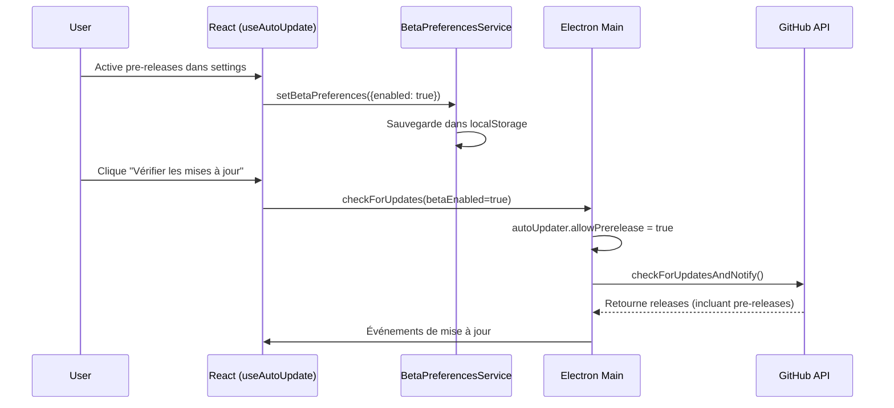

# Design Document

## Overview

Le problème identifié est que les utilisateurs ayant activé l'option pour recevoir les pre-releases GitHub ne reçoivent pas la version v1.0.31 qui est correctement marquée comme `prerelease: true` sur GitHub. L'analyse révèle que le système de mise à jour est théoriquement bien configuré, mais il semble y avoir un problème dans la synchronisation entre les préférences utilisateur et la configuration d'electron-updater, ou dans le timing des vérifications.

## Architecture

### Composants Impliqués

1. **BetaPreferencesService** : Gère le stockage des préférences dans localStorage
2. **useAutoUpdate Hook** : Interface React pour les mises à jour
3. **Electron Main Process** : Gère autoUpdater et les handlers IPC
4. **electron-updater** : Bibliothèque qui communique avec GitHub API

### Flux de Données Actuel



## Problèmes Identifiés

### 1. Problème de Timing
Le système configure `autoUpdater.allowPrerelease` au démarrage avec `getBetaPreferences()`, mais cette fonction lit depuis localStorage qui peut ne pas être disponible ou synchronisé au moment du démarrage d'Electron.

### 2. Problème de Cache
electron-updater peut avoir mis en cache la réponse de GitHub et ne pas refaire de requête même quand `allowPrerelease` change.

### 3. Problème de Configuration GitHub
La configuration `publish.provider: "github"` dans package.json est correcte, mais il faut vérifier que les fichiers `latest-mac.yml` sont correctement générés pour les pre-releases.

## Solutions Proposées

### Solution 1: Améliorer la Synchronisation des Préférences

```typescript
// Dans electron/main.ts
function getBetaPreferences(): BetaPreferences {
  try {
    // Lire directement depuis le fichier de préférences Electron
    const userDataPath = app.getPath('userData')
    const prefsPath = path.join(userDataPath, 'beta-preferences.json')
    
    if (fs.existsSync(prefsPath)) {
      const data = fs.readFileSync(prefsPath, 'utf8')
      return JSON.parse(data)
    }
  } catch (error) {
    log.error('Erreur lecture préférences beta:', error)
  }
  
  return { enabled: false, lastModified: Date.now(), hasBeenWarned: false }
}
```

### Solution 2: Forcer la Mise à Jour du Cache

```typescript
// Dans le handler check-for-updates
ipcMain.handle('check-for-updates', async (event, betaEnabled = false) => {
  try {
    // Configurer les pre-releases
    autoUpdater.allowPrerelease = betaEnabled
    
    // Forcer la mise à jour du cache en changeant l'URL temporairement
    if (betaEnabled) {
      // Forcer electron-updater à refaire une requête
      autoUpdater.setFeedURL({
        provider: 'github',
        owner: 'doctorbankai',
        repo: 'Dimi_Call',
        private: false
      })
    }
    
    log.info(`Vérification avec allowPrerelease=${betaEnabled}`)
    const result = await autoUpdater.checkForUpdates()
    
    return { status: 'checking', message: 'Vérification lancée.' }
  } catch (error) {
    log.error('Erreur vérification:', error)
    return { status: 'error', message: error.message }
  }
})
```

### Solution 3: Diagnostic Avancé

```typescript
// Ajouter des logs détaillés pour diagnostiquer
autoUpdater.on('checking-for-update', () => {
  log.info(`🔍 Vérification mises à jour - allowPrerelease: ${autoUpdater.allowPrerelease}`)
})

autoUpdater.on('update-available', (info) => {
  log.info(`📦 Mise à jour trouvée: ${info.version}`)
  log.info(`📦 Pre-release: ${info.prerelease || 'non défini'}`)
  log.info(`📦 Release date: ${info.releaseDate}`)
})

autoUpdater.on('update-not-available', (info) => {
  log.info(`✅ Pas de mise à jour - Version actuelle: ${info.version}`)
  log.info(`✅ allowPrerelease était: ${autoUpdater.allowPrerelease}`)
})
```

## Composants à Modifier

### 1. BetaPreferencesService
- Ajouter une méthode pour synchroniser avec le système de fichiers Electron
- Améliorer la persistance des préférences

### 2. Electron Main Process
- Améliorer la lecture des préférences au démarrage
- Ajouter des logs de diagnostic détaillés
- Forcer la mise à jour du cache electron-updater

### 3. Hook useAutoUpdate
- Ajouter une méthode pour forcer la synchronisation des préférences
- Améliorer la gestion des erreurs

## Tests de Validation

### Test 1: Vérification API GitHub
```bash
# Vérifier que v1.0.31 est bien une pre-release
curl -s "https://api.github.com/repos/doctorbankai/Dimi_Call/releases/tags/v1.0.31" | jq '.prerelease'
# Doit retourner: true
```

### Test 2: Test Manuel dans l'Application
1. Activer les pre-releases dans les paramètres
2. Vérifier que localStorage contient `{"enabled": true}`
3. Redémarrer l'application
4. Vérifier les mises à jour manuellement
5. Vérifier les logs Electron pour voir si `allowPrerelease=true`

### Test 3: Test de Cache
1. Désactiver les pre-releases
2. Vérifier les mises à jour (doit trouver v1.0.26)
3. Activer les pre-releases
4. Vérifier immédiatement les mises à jour (doit trouver v1.0.31)

## Métriques de Succès

1. **Détection Correcte** : Quand pre-releases activées, v1.0.31 doit être détectée
2. **Logs Clairs** : Les logs doivent montrer clairement l'état d'allowPrerelease
3. **Persistance** : Les préférences doivent persister après redémarrage
4. **Réactivité** : Le changement de préférence doit être immédiatement effectif