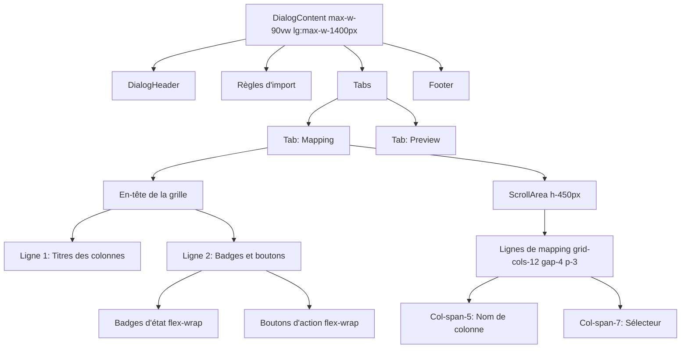

# Design Document

## Overview

Ce document décrit la conception des corrections de mise en page pour le dialogue "Importer et mapper les colonnes". L'objectif est de résoudre les problèmes de compression, d'espacement et de disposition des éléments pour offrir une interface utilisateur claire et utilisable.

## Architecture

### Composants concernés

- **ImportMappingDialog.tsx** : Le composant principal qui nécessite des ajustements de mise en page
- **DialogContent** : Utilise actuellement `max-w-5xl` qui sera ajusté
- **Grid system** : Utilise `grid-cols-12` qui sera optimisé pour une meilleure répartition

### Approche de conception

La solution se concentre sur trois axes principaux :
1. **Largeur du dialogue** : Augmenter la largeur maximale et la rendre responsive
2. **Structure de la grille** : Simplifier et optimiser la répartition des colonnes
3. **Disposition de l'en-tête** : Réorganiser les badges et boutons pour éviter la compression

## Components and Interfaces

### 1. DialogContent - Ajustement de la largeur

**Changement actuel :**
```tsx
<DialogContent className="max-w-5xl">
```

**Nouveau design :**
```tsx
<DialogContent className="max-w-[90vw] lg:max-w-[1400px] w-full">
```

**Justification :**
- `max-w-[90vw]` : Utilise 90% de la largeur de la fenêtre sur les petits écrans
- `lg:max-w-[1400px]` : Limite à 1400px sur les grands écrans
- `w-full` : Assure que le dialogue utilise toute la largeur disponible jusqu'à la limite

### 2. En-tête de la grille - Réorganisation

**Structure actuelle :**
```tsx
<div className="grid grid-cols-12 gap-2 p-2 bg-muted/50 text-xs font-medium">
  <div className="col-span-5">Colonne détectée</div>
  <div className="col-span-7 flex items-center justify-between">
    <span>Associer à</span>
    <div className="flex items-center gap-2">
      {/* Badges et boutons */}
    </div>
  </div>
</div>
```

**Nouveau design :**
```tsx
<div className="bg-muted/50 rounded-t-lg">
  {/* Ligne 1 : Titres des colonnes */}
  <div className="grid grid-cols-12 gap-4 p-3 border-b">
    <div className="col-span-5 font-medium text-sm">Colonne détectée</div>
    <div className="col-span-7 font-medium text-sm">Associer à</div>
  </div>
  
  {/* Ligne 2 : Badges et actions */}
  <div className="flex flex-wrap items-center justify-between gap-3 p-3">
    <div className="flex flex-wrap items-center gap-2">
      {/* Badges d'état */}
    </div>
    <div className="flex flex-wrap items-center gap-2">
      {/* Boutons d'action */}
    </div>
  </div>
</div>
```

**Justification :**
- Sépare les titres des colonnes des badges/boutons
- Utilise `flex-wrap` pour permettre le retour à la ligne sur les petits écrans
- Augmente l'espacement avec `gap-3` et `gap-4`
- Améliore la lisibilité avec `text-sm` au lieu de `text-xs`

### 3. Grille de mapping - Optimisation des colonnes

**Changement actuel :**
```tsx
<div className="grid grid-cols-12 gap-2 p-2 items-center">
  <div className="col-span-5 truncate flex items-center gap-1">
  <div className="col-span-7">
```

**Nouveau design :**
```tsx
<div className="grid grid-cols-12 gap-4 p-3 items-center">
  <div className="col-span-5 truncate flex items-center gap-2">
  <div className="col-span-7">
```

**Justification :**
- Augmente `gap-2` à `gap-4` pour plus d'espacement horizontal
- Augmente `p-2` à `p-3` pour plus d'espacement vertical
- Augmente `gap-1` à `gap-2` pour les icônes et texte

### 4. ScrollArea - Hauteur optimisée

**Changement actuel :**
```tsx
<ScrollArea className="h-[320px]">
```

**Nouveau design :**
```tsx
<ScrollArea className="h-[450px] max-h-[60vh]">
```

**Justification :**
- Augmente la hauteur de 320px à 450px pour afficher plus de lignes
- Ajoute `max-h-[60vh]` pour s'adapter aux petits écrans
- Permet de voir 8-10 lignes au lieu de 5-6

### 5. Sélecteurs de champs - Largeur optimisée

**Changement actuel :**
```tsx
<SelectTrigger className="h-8 text-xs">
```

**Nouveau design :**
```tsx
<SelectTrigger className="h-9 text-sm w-full max-w-md">
```

**Justification :**
- Augmente la hauteur de `h-8` à `h-9` pour plus de confort
- Change `text-xs` à `text-sm` pour meilleure lisibilité
- Ajoute `w-full max-w-md` pour utiliser l'espace disponible

## Data Models

Aucun changement aux modèles de données n'est nécessaire. Les modifications sont purement visuelles et n'affectent pas la logique métier.

## Error Handling

Aucun nouveau cas d'erreur n'est introduit. Les validations existantes restent inchangées.

## Testing Strategy

### Tests visuels

1. **Test de largeur responsive**
   - Tester sur différentes résolutions (1920x1080, 1366x768, 1024x768)
   - Vérifier que le dialogue s'adapte correctement
   - Vérifier qu'il n'y a pas de défilement horizontal

2. **Test de l'en-tête**
   - Vérifier que tous les badges sont visibles
   - Vérifier que les boutons ne se chevauchent pas
   - Tester le retour à la ligne sur les petits écrans

3. **Test de la grille**
   - Vérifier que les noms de colonnes sont lisibles
   - Vérifier que les sélecteurs sont accessibles
   - Tester le défilement vertical

4. **Test des états**
   - Tester avec 5 colonnes (peu de colonnes)
   - Tester avec 15 colonnes (beaucoup de colonnes)
   - Tester avec des noms de colonnes longs
   - Tester avec des conflits de mapping

### Tests fonctionnels

1. Vérifier que toutes les fonctionnalités existantes continuent de fonctionner
2. Vérifier que les interactions (sélection, auto-détection, résolution de conflits) fonctionnent correctement
3. Vérifier que la validation et l'import fonctionnent comme avant

## Design Decisions

### Décision 1 : Utiliser 90vw au lieu d'une largeur fixe

**Rationale :** Permet au dialogue de s'adapter à différentes tailles d'écran tout en gardant des marges appropriées. Plus flexible qu'une largeur fixe.

### Décision 2 : Séparer l'en-tête en deux lignes

**Rationale :** Évite la compression des éléments et améliore la lisibilité. Les titres des colonnes sont clairement séparés des actions.

### Décision 3 : Augmenter les espacements de manière cohérente

**Rationale :** Passer de `gap-2` à `gap-4` et de `p-2` à `p-3` crée une interface plus aérée et professionnelle sans gaspiller l'espace.

### Décision 4 : Utiliser flex-wrap pour les badges et boutons

**Rationale :** Permet une disposition responsive naturelle sans media queries complexes. Les éléments se réorganisent automatiquement selon l'espace disponible.

### Décision 5 : Augmenter la hauteur de la ScrollArea

**Rationale :** Avec plus de largeur disponible, on peut aussi augmenter la hauteur pour afficher plus de lignes et réduire le besoin de défilement.

## Mermaid Diagram - Structure du dialogue



## Visual Comparison

### Avant (problèmes identifiés)
- Largeur : `max-w-5xl` (768px) - trop étroit
- En-tête : Tout sur une ligne - compressé
- Espacement : `gap-2`, `p-2` - serré
- Hauteur : `h-[320px]` - peu de lignes visibles
- Texte : `text-xs` - petit

### Après (améliorations)
- Largeur : `max-w-[90vw] lg:max-w-[1400px]` - spacieux et responsive
- En-tête : Deux lignes séparées - clair et organisé
- Espacement : `gap-4`, `p-3` - aéré et confortable
- Hauteur : `h-[450px] max-h-[60vh]` - plus de lignes visibles
- Texte : `text-sm` - plus lisible
