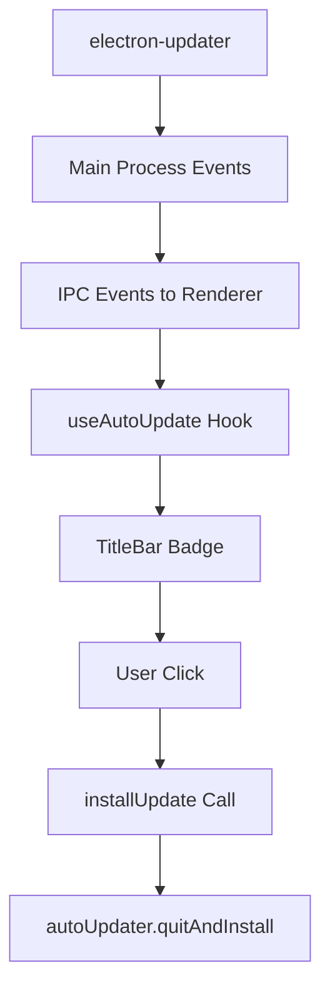

# Design Document

## Overview

Cette fonctionnalité améliore l'expérience utilisateur du système de mise à jour en modifiant l'affichage du badge et en ajoutant une confirmation avant l'installation. Le système actuel utilise electron-updater avec un téléchargement automatique et une installation manuelle déclenchée par l'utilisateur.

## Architecture

### Architecture Actuelle

Le système de mise à jour suit cette architecture :

1. **Main Process (electron/main.ts)** : Gère electron-updater, émet des événements IPC
2. **Preload (electron/preload.ts)** : Expose les APIs de mise à jour au renderer
3. **Hook React (src/hooks/useAutoUpdate.ts)** : Gère l'état de mise à jour côté UI
4. **TitleBar Component (src/components/TitleBar.tsx)** : Affiche le badge de mise à jour
5. **App Component (src/App.tsx)** : Orchestre l'utilisation du hook et du composant

### Flux de Données Actuel



## Components and Interfaces

### 1. Nouveau Composant : UpdateConfirmationDialog

Un nouveau composant dialog sera créé pour la confirmation de mise à jour.

**Interface :**
```typescript
interface UpdateConfirmationDialogProps {
  isOpen: boolean;
  onClose: () => void;
  onConfirm: () => void;
  updateInfo?: {
    version: string;
    releaseDate?: string;
    releaseName?: string;
    releaseNotes?: string;
  } | null;
}
```

**Fonctionnalités :**
- Utilise les composants shadcn/ui (Dialog, Button)
- Respecte le thème actuel (sombre/clair)
- Affiche les informations de la mise à jour
- Propose deux actions : "Oui, mettre à jour" et "Annuler"
- Fermeture possible avec Échap

### 2. Modification du TitleBar Component

**Changements requis :**
- Modifier le texte du badge quand `updateState.downloaded` est true
- Changer "MAJ" en "Mettre à jour"
- Mettre à jour le tooltip correspondant
- Gérer l'ouverture du dialog de confirmation au lieu d'appeler directement `installUpdate`

**Nouvelle logique :**
```typescript
// Dans TitleBar.tsx
const handleUpdateClick = () => {
  if (updateState.downloaded) {
    // Ouvrir le dialog de confirmation au lieu d'installer directement
    onUpdateConfirmationOpen();
  }
};
```

### 3. Modification du Hook useAutoUpdate

**Ajouts requis :**
- Pas de modification majeure du hook
- Le hook continue de gérer l'état de mise à jour
- La fonction `installUpdate` reste inchangée

### 4. Modification de App.tsx

**Ajouts requis :**
- État pour gérer l'ouverture/fermeture du dialog de confirmation
- Fonction de callback pour ouvrir le dialog
- Rendu du nouveau composant UpdateConfirmationDialog

## Data Models

### UpdateState (existant - pas de modification)

```typescript
interface UpdateState {
  checking: boolean;
  available: boolean;
  downloading: boolean;
  downloaded: boolean;
  error: string | null;
  progress: number;
  updateInfo: UpdateInfo | null;
}
```

### UpdateInfo (existant - pas de modification)

```typescript
interface UpdateInfo {
  version: string;
  releaseDate?: string;
  releaseName?: string;
  releaseNotes?: string;
}
```

## Error Handling

### Gestion des Erreurs Existante

Le système actuel gère déjà :
- Erreurs de vérification de mise à jour
- Erreurs de téléchargement
- Erreurs d'installation

### Nouvelles Considérations d'Erreur

1. **Dialog ne s'ouvre pas** : Fallback vers l'installation directe
2. **Erreur lors de la confirmation** : Affichage d'un message d'erreur
3. **État incohérent** : Vérification de `updateState.downloaded` avant d'afficher le dialog

## Testing Strategy

### Tests Unitaires

1. **UpdateConfirmationDialog Component**
   - Rendu correct avec différents thèmes
   - Gestion des événements de clic
   - Fermeture avec Échap
   - Affichage des informations de mise à jour

2. **TitleBar Component**
   - Affichage correct du texte "Mettre à jour"
   - Tooltip mis à jour
   - Gestion du clic pour ouvrir le dialog

### Tests d'Intégration

1. **Flux Complet de Mise à Jour**
   - Téléchargement → Badge "Mettre à jour" → Dialog → Installation
   - Annulation du dialog → Retour à l'état normal
   - Gestion des erreurs à chaque étape

### Tests Manuels

1. **Scénarios Utilisateur**
   - Téléchargement d'une mise à jour réelle
   - Test du dialog de confirmation
   - Test de l'annulation
   - Test de la confirmation et installation

## Implementation Notes

### Ordre d'Implémentation

1. Créer le composant UpdateConfirmationDialog
2. Modifier TitleBar pour utiliser le nouveau texte et ouvrir le dialog
3. Modifier App.tsx pour gérer l'état du dialog
4. Tester le flux complet

### Considérations de Performance

- Le dialog est rendu conditionnellement (pas d'impact sur les performances)
- Pas de modification des APIs Electron existantes
- Utilisation des composants shadcn/ui optimisés

### Compatibilité

- Compatible avec tous les OS supportés (Windows, macOS, Linux)
- Respecte les thèmes existants
- Maintient la compatibilité avec electron-updater

### Sécurité

- Pas de nouvelles surfaces d'attaque
- Utilise les APIs IPC existantes et sécurisées
- Validation des données de mise à jour côté renderer