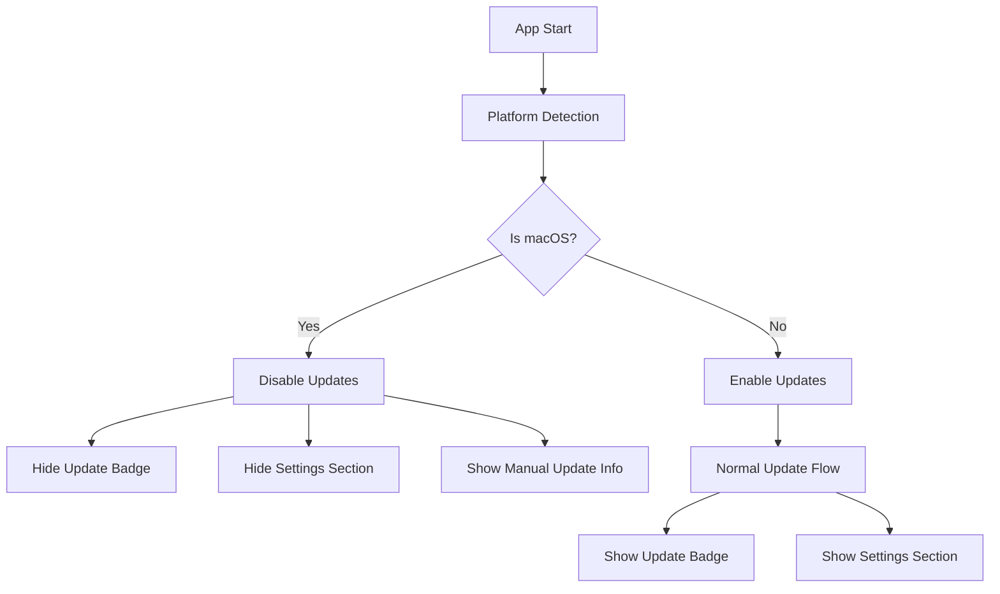
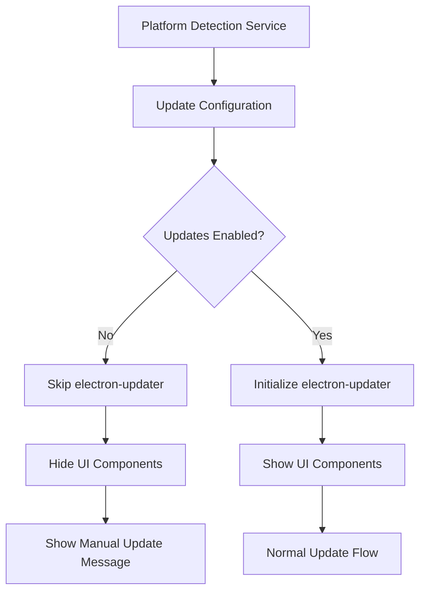

# Design Document

## Overview

Cette fonctionnalité désactive complètement le système de mise à jour automatique pour les versions macOS (.dmg) de l'application DimiCall. La solution utilise une approche basée sur la détection de plateforme et des variables d'environnement pour désactiver sélectivement les composants de mise à jour uniquement sur macOS, tout en préservant la fonctionnalité complète sur Windows et Linux.

## Architecture

### Architecture Actuelle du Système de Mise à jour

Le système de mise à jour suit cette architecture :

1. **Main Process (electron/main.ts)** : Configure electron-updater, gère les événements de mise à jour
2. **Preload (electron/preload.ts)** : Expose les APIs de mise à jour au renderer via IPC
3. **Hook React (src/hooks/useAutoUpdate.ts)** : Gère l'état de mise à jour côté UI
4. **TitleBar Component (src/components/TitleBar.tsx)** : Affiche le badge de mise à jour
5. **SettingsDialog Component (src/components/SettingsDialog.tsx)** : Affiche la section mise à jour dans les paramètres

### Architecture Proposée avec Désactivation macOS



### Flux de Données avec Désactivation



## Components and Interfaces

### 1. Nouveau Service : PlatformUpdateService

Un nouveau service sera créé pour gérer la configuration des mises à jour basée sur la plateforme.

**Interface :**
```typescript
interface UpdateConfiguration {
  enabled: boolean;
  platform: 'darwin' | 'win32' | 'linux';
  reason?: string;
  manualUpdateUrl?: string;
}

class PlatformUpdateService {
  static getUpdateConfiguration(): UpdateConfiguration;
  static isUpdateEnabled(): boolean;
  static getManualUpdateInfo(): { url: string; message: string } | null;
}
```

**Fonctionnalités :**
- Détection automatique de la plateforme
- Configuration basée sur les variables d'environnement
- Fourniture d'informations pour les mises à jour manuelles

### 2. Modification du Main Process (electron/main.ts)

**Changements requis :**
- Vérification de la plateforme avant d'initialiser electron-updater
- Désactivation complète d'electron-updater sur macOS
- Gestion des événements IPC conditionnelle

**Nouvelle logique :**
```typescript
// Dans electron/main.ts
import { PlatformUpdateService } from './services/PlatformUpdateService'

const updateConfig = PlatformUpdateService.getUpdateConfiguration()

if (updateConfig.enabled) {
  // Initialiser electron-updater normalement
  autoUpdater.checkForUpdatesAndNotify()
} else {
  console.log(`Updates disabled: ${updateConfig.reason}`)
}
```

### 3. Modification du Hook useAutoUpdate

**Changements requis :**
- Vérification de la configuration de mise à jour au démarrage
- État désactivé par défaut sur macOS
- Pas d'initialisation des listeners d'événements si désactivé

**Nouvelle interface :**
```typescript
interface UseAutoUpdateResult {
  updateState: UpdateState;
  checkForUpdates: () => void;
  installUpdate: () => void;
  isUpdateEnabled: boolean;
  manualUpdateInfo?: { url: string; message: string };
}
```

### 4. Modification du TitleBar Component

**Changements requis :**
- Masquage conditionnel du badge de mise à jour
- Vérification de `isUpdateEnabled` avant le rendu

**Nouvelle logique :**
```typescript
// Dans TitleBar.tsx
const { updateState, isUpdateEnabled } = useAutoUpdate()

// Ne pas afficher le badge si les mises à jour sont désactivées
if (!isUpdateEnabled) {
  return null // ou ne pas rendre la section update
}
```

### 5. Modification du SettingsDialog Component

**Changements requis :**
- Masquage conditionnel de la section mise à jour
- Affichage d'un message informatif pour les mises à jour manuelles sur macOS

**Nouvelle section pour macOS :**
```typescript
// Dans SettingsDialog.tsx
const ManualUpdateInfo = () => (
  <Card>
    <CardHeader>
      <CardTitle className="flex items-center gap-2">
        <Info className="h-4 w-4" />
        Mises à jour
      </CardTitle>
    </CardHeader>
    <CardContent>
      <p className="text-sm text-muted-foreground mb-3">
        Les mises à jour automatiques ne sont pas disponibles sur macOS. 
        Pour obtenir la dernière version, téléchargez-la manuellement depuis GitHub.
      </p>
      <Button 
        variant="outline" 
        onClick={() => shell.openExternal('https://github.com/your-repo/releases')}
        className="w-full"
      >
        <ExternalLink className="h-4 w-4 mr-2" />
        Voir les releases sur GitHub
      </Button>
    </CardContent>
  </Card>
)
```

### 6. Modification du GitHub Actions Workflow

**Changements requis :**
- Ajout d'une variable d'environnement pour identifier les builds macOS
- Configuration spécifique pour désactiver les mises à jour

**Nouvelle configuration :**
```yaml
# Dans .github/workflows/release.yml
- name: Build & Publish macOS
  if: matrix.os == 'macos-latest'
  run: npx electron-builder --mac --publish always
  env:
    GH_TOKEN: ${{ secrets.GITHUB_TOKEN }}
    NODE_ENV: production
    DISABLE_AUTO_UPDATES: "true"  # Nouvelle variable
    MANUAL_UPDATE_URL: "https://github.com/${{ github.repository }}/releases"
```

## Data Models

### UpdateConfiguration

```typescript
interface UpdateConfiguration {
  enabled: boolean;
  platform: 'darwin' | 'win32' | 'linux';
  reason?: string;
  manualUpdateUrl?: string;
  buildEnvironment?: 'github-actions' | 'local' | 'unknown';
}
```

### UpdateState (modification)

```typescript
interface UpdateState {
  checking: boolean;
  available: boolean;
  downloading: boolean;
  downloaded: boolean;
  error: string | null;
  progress: number;
  updateInfo: UpdateInfo | null;
  enabled: boolean; // Nouveau champ
}
```

### ManualUpdateInfo

```typescript
interface ManualUpdateInfo {
  url: string;
  message: string;
  platform: string;
  version: string;
}
```

## Error Handling

### Gestion des Erreurs de Détection de Plateforme

1. **Plateforme non reconnue** : Désactiver les mises à jour par sécurité
2. **Variables d'environnement manquantes** : Utiliser les valeurs par défaut
3. **Erreur de configuration** : Logger l'erreur et désactiver les mises à jour

### Gestion des Erreurs de Configuration

1. **Service indisponible** : Fallback vers la détection de plateforme simple
2. **URL manuelle invalide** : Utiliser l'URL GitHub par défaut
3. **État incohérent** : Réinitialiser la configuration

## Testing Strategy

### Tests Unitaires

1. **PlatformUpdateService**
   - Détection correcte de chaque plateforme
   - Gestion des variables d'environnement
   - Configuration par défaut

2. **useAutoUpdate Hook**
   - État désactivé sur macOS
   - État activé sur autres plateformes
   - Gestion des informations de mise à jour manuelle

3. **Components**
   - Masquage conditionnel des éléments UI
   - Affichage correct du message informatif
   - Gestion des clics sur les liens externes

### Tests d'Intégration

1. **Flux Complet par Plateforme**
   - macOS : Vérification de la désactivation complète
   - Windows/Linux : Vérification du fonctionnement normal
   - GitHub Actions : Vérification des variables d'environnement

### Tests Manuels

1. **Scénarios par Plateforme**
   - Build local sur macOS avec mises à jour désactivées
   - Build GitHub Actions sur macOS avec désactivation
   - Build sur Windows/Linux avec fonctionnement normal

## Implementation Notes

### Ordre d'Implémentation

1. Créer le PlatformUpdateService
2. Modifier le main process pour utiliser la configuration
3. Modifier le hook useAutoUpdate
4. Modifier les composants UI (TitleBar, SettingsDialog)
5. Mettre à jour le workflow GitHub Actions
6. Tester sur toutes les plateformes

### Variables d'Environnement

```bash
# Pour désactiver les mises à jour (GitHub Actions macOS)
DISABLE_AUTO_UPDATES=true
MANUAL_UPDATE_URL=https://github.com/repo/releases

# Pour forcer l'activation en développement local
FORCE_ENABLE_UPDATES=true
```

### Considérations de Performance

- Détection de plateforme une seule fois au démarrage
- Pas d'impact sur les performances des autres plateformes
- Réduction de la charge réseau sur macOS (pas de vérification de mises à jour)

### Compatibilité

- Compatible avec toutes les versions d'Electron
- Pas de modification des APIs existantes
- Rétrocompatible avec les builds existants

### Sécurité

- Désactivation par défaut en cas d'erreur de détection
- Validation des URLs de mise à jour manuelle
- Pas d'exposition de données sensibles dans les logs

### Configuration Electron Builder

```json
// Dans electron-builder configuration
{
  "mac": {
    "target": [
      {
        "target": "dmg",
        "arch": ["x64", "arm64"]
      }
    ]
  },
  "publish": {
    "provider": "github",
    "publishAutoUpdate": false // Pour macOS uniquement
  }
}
```

Cette configuration peut être rendue conditionnelle basée sur la plateforme de build.