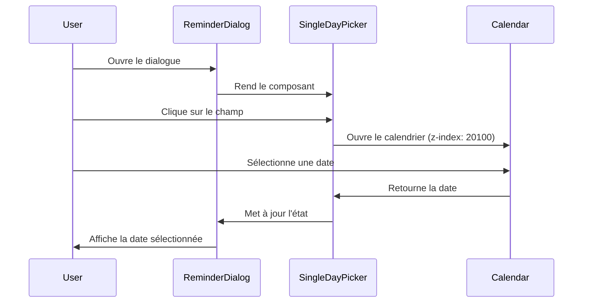

# Design Document - Correction du Dialogue de Rappel

## Overview

Ce document décrit la solution technique pour corriger les problèmes d'interface utilisateur dans le dialogue "Programmer un rappel". La solution se concentre sur la gestion appropriée du z-index, l'utilisation correcte des portails React, et le remplacement de l'input date natif par le calendrier shadcn.

## Architecture

### Composants concernés

```
ReminderDialog (src/components/ReminderDialog.tsx)
├── SingleDayPicker (src/components/ui/single-day-picker.tsx)
├── TimePicker (src/components/ui/time-picker.tsx)
└── RelativeDateSelector (src/components/RelativeDateSelector.tsx)
    └── Select (shadcn)
        └── SelectContent
```

### Hiérarchie de z-index

```
Dialog Overlay: z-50 (défaut shadcn)
Dialog Content: z-[20000] (actuel)
├── Popover/Select Content: z-[20100] (nouveau)
├── Calendar Popover: z-[20100] (nouveau)
└── TimePicker Popover: z-[20100] (nouveau)
```

## Components and Interfaces

### 1. ReminderDialog

**Modifications nécessaires:**

- Supprimer complètement l'`<Input type="date">` caché
- Utiliser uniquement `SingleDayPicker` pour la sélection de date
- Passer le `dialogContentRef` à tous les composants enfants via la prop `container`
- Assurer que tous les popovers utilisent le bon z-index

**Interface mise à jour:**

```typescript
interface ReminderDialogProps {
  isOpen: boolean;
  onClose: () => void;
  contact: Contact;
  initialDate?: string;
  initialTime?: string;
  onSave: (date: string, time: string) => void;
}
```

### 2. SingleDayPicker

**Modifications nécessaires:**

- Ajouter une prop `zIndex` optionnelle
- Appliquer le z-index au `PopoverContent`
- Utiliser la prop `container` pour le portail

**Interface mise à jour:**

```typescript
type SingleDayPickerProps = Omit<ButtonHTMLAttributes<HTMLButtonElement>, "onSelect" | "value"> & {
  onSelect: (value: Date | undefined) => void;
  value?: Date | undefined;
  placeholder: string;
  labelVariant?: "P" | "PP" | "PPP";
  container?: HTMLElement | null;
  zIndex?: number; // Nouveau
};
```

### 3. TimePicker

**Modifications nécessaires:**

- Le composant a déjà une prop `zIndex` avec valeur par défaut 250
- Augmenter la valeur par défaut à 20100
- S'assurer que le z-index est appliqué correctement au `PopoverContent`

**Interface actuelle (à ajuster):**

```typescript
interface TimePickerProps {
  value: string;
  onChange: (time: string) => void;
  disabled?: boolean;
  placeholder?: string;
  className?: string;
  id?: string;
  'aria-label'?: string;
  'aria-describedby'?: string;
  container?: HTMLElement | null;
  zIndex?: number; // Déjà présent, ajuster la valeur par défaut
}
```

### 4. RelativeDateSelector

**Modifications nécessaires:**

- S'assurer que le `SelectContent` utilise le `portalContainer`
- Ajouter une prop `zIndex` pour le `SelectContent`
- Appliquer le z-index via une classe ou un style inline

**Interface mise à jour:**

```typescript
interface RelativeDateSelectorProps {
  onDateChange: (date: string) => void;
  currentDate: string;
  disabled?: boolean;
  className?: string;
  portalContainer?: HTMLElement | null;
  zIndex?: number; // Nouveau
}
```

### 5. Select Component (shadcn)

**Modifications nécessaires:**

- Le composant `Select` de shadcn doit accepter une prop `container` pour le portail
- Le `SelectContent` doit accepter une prop `zIndex` ou `className` pour appliquer le z-index

**Approche:**

Utiliser la prop `container` existante du `SelectContent` et ajouter une classe CSS avec le z-index approprié.

## Data Models

Aucune modification des modèles de données n'est nécessaire. Les interfaces existantes pour `Contact` et les états du dialogue restent inchangées.

## Error Handling

### Gestion des erreurs de z-index

- Si le z-index n'est pas appliqué correctement, les dropdowns apparaîtront derrière le dialogue
- Solution: Vérifier dans les DevTools que les styles inline ou classes CSS sont bien appliqués

### Gestion des erreurs de portail

- Si le `container` n'est pas défini ou est `null`, le portail utilisera le comportement par défaut (body)
- Solution: S'assurer que `dialogContentRef.current` est toujours défini avant de le passer aux composants enfants

### Gestion des erreurs de sélection de date

- Les validations existantes dans `DateCalculationService` restent en place
- Aucune modification nécessaire

## Testing Strategy

### Tests unitaires

1. **ReminderDialog**
   - Vérifier que le `SingleDayPicker` est rendu sans input date natif
   - Vérifier que tous les composants reçoivent la prop `container`
   - Vérifier que les z-index sont correctement appliqués

2. **SingleDayPicker**
   - Vérifier que le z-index est appliqué au `PopoverContent`
   - Vérifier que le portail utilise le bon container

3. **TimePicker**
   - Vérifier que le z-index par défaut est 20100
   - Vérifier que le portail utilise le bon container

4. **RelativeDateSelector**
   - Vérifier que le `SelectContent` utilise le bon z-index
   - Vérifier que le portail utilise le bon container

### Tests d'intégration

1. **Ouverture du dialogue de rappel**
   - Ouvrir le dialogue
   - Cliquer sur le sélecteur d'unité de temps
   - Vérifier que le dropdown apparaît au-dessus du dialogue

2. **Sélection de date**
   - Ouvrir le dialogue
   - Cliquer sur le champ de date
   - Vérifier que le calendrier shadcn s'ouvre
   - Sélectionner une date
   - Vérifier que la date est mise à jour

3. **Sélection d'heure**
   - Ouvrir le dialogue
   - Cliquer sur le champ d'heure
   - Vérifier que le TimePicker s'ouvre au-dessus du dialogue
   - Sélectionner une heure
   - Vérifier que l'heure est mise à jour

### Tests visuels

1. Vérifier que tous les dropdowns sont visibles et accessibles
2. Vérifier que le style est cohérent avec le reste de l'application
3. Vérifier le comportement responsive sur mobile

### Tests d'accessibilité

1. Navigation au clavier (Tab, Enter, Escape)
2. Lecteurs d'écran (ARIA labels, descriptions)
3. Contraste des couleurs
4. Focus visible

## Implementation Notes

### Ordre d'implémentation recommandé

1. **Phase 1: Ajout du z-index au SingleDayPicker**
   - Ajouter la prop `zIndex` à `SingleDayPicker`
   - Appliquer le z-index au `PopoverContent`
   - Tester l'ouverture du calendrier dans le dialogue

2. **Phase 2: Ajustement du TimePicker**
   - Modifier la valeur par défaut du z-index à 20100
   - Vérifier que le style est appliqué correctement
   - Tester l'ouverture du TimePicker dans le dialogue

3. **Phase 3: Correction du RelativeDateSelector**
   - Ajouter la prop `zIndex` à `RelativeDateSelector`
   - Appliquer le z-index au `SelectContent` via className ou style
   - Tester l'ouverture du Select dans le dialogue

4. **Phase 4: Nettoyage du ReminderDialog**
   - Supprimer l'input date natif caché
   - Passer les props `container` et `zIndex` à tous les composants
   - Vérifier que tout fonctionne correctement

5. **Phase 5: Tests et validation**
   - Exécuter tous les tests
   - Vérifier visuellement sur différents navigateurs
   - Tester l'accessibilité

### Considérations techniques

#### Z-index avec Tailwind CSS

Tailwind CSS ne génère pas automatiquement toutes les valeurs de z-index. Pour utiliser `z-[20100]`, deux options:

1. **Classe arbitraire Tailwind** (recommandé):
   ```tsx
   <PopoverContent className="z-[20100]" />
   ```

2. **Style inline**:
   ```tsx
   <PopoverContent style={{ zIndex: 20100 }} />
   ```

#### Portails React

Les composants shadcn utilisent `@radix-ui/react-portal` pour rendre les popovers. La prop `container` permet de spécifier où le portail doit être rendu:

```tsx
<PopoverContent container={dialogContentRef.current}>
  {/* Contenu */}
</PopoverContent>
```

#### Gestion des refs

Le `dialogContentRef` doit être créé avec `useRef` et attaché au `DialogContent`:

```tsx
const dialogContentRef = React.useRef<HTMLDivElement>(null);

<DialogContent ref={dialogContentRef}>
  {/* Contenu */}
</DialogContent>
```

### Compatibilité

- React 18+
- Radix UI (utilisé par shadcn)
- Tailwind CSS 3+
- Navigateurs modernes (Chrome, Firefox, Safari, Edge)

### Performance

Aucun impact significatif sur les performances. Les modifications sont purement CSS et ne changent pas la logique de rendu.

## Diagrams

### Flux de sélection de date



### Hiérarchie des z-index

```
┌─────────────────────────────────────┐
│ Body (z-index: auto)                │
│  ┌───────────────────────────────┐  │
│  │ Dialog Overlay (z-50)         │  │
│  │  ┌─────────────────────────┐  │  │
│  │  │ Dialog Content (20000)  │  │  │
│  │  │  ┌───────────────────┐  │  │  │
│  │  │  │ Form Content      │  │  │  │
│  │  │  └───────────────────┘  │  │  │
│  │  └─────────────────────────┘  │  │
│  │  ┌─────────────────────────┐  │  │
│  │  │ Popover (20100)         │  │  │
│  │  │ - Calendar              │  │  │
│  │  │ - TimePicker            │  │  │
│  │  │ - SelectContent         │  │  │
│  │  └─────────────────────────┘  │  │
│  └───────────────────────────────┘  │
└─────────────────────────────────────┘
```

## Design Decisions

### Pourquoi z-index 20100 ?

- Le dialogue utilise `z-[20000]`
- Les popovers doivent être au-dessus du dialogue
- Un écart de 100 permet d'ajouter d'autres couches si nécessaire
- Cohérent avec les conventions shadcn/Radix UI

### Pourquoi supprimer l'input date natif ?

- L'input natif est caché (`sr-only`) mais existe toujours dans le DOM
- Cela crée de la confusion et du code inutile
- Le `SingleDayPicker` fournit déjà toutes les fonctionnalités nécessaires
- Meilleure cohérence visuelle avec le reste de l'application

### Pourquoi utiliser des portails ?

- Les portails permettent de rendre les composants en dehors de leur hiérarchie DOM parente
- Cela évite les problèmes de `overflow: hidden` et de z-index
- Radix UI (utilisé par shadcn) gère automatiquement les portails
- La prop `container` permet de contrôler où le portail est rendu

### Pourquoi ne pas modifier le z-index du dialogue ?

- Le z-index actuel (`z-[20000]`) est déjà très élevé
- Modifier le z-index du dialogue pourrait créer des conflits avec d'autres composants
- Il est plus propre d'augmenter le z-index des popovers enfants
- Cette approche est plus maintenable et évolutive
