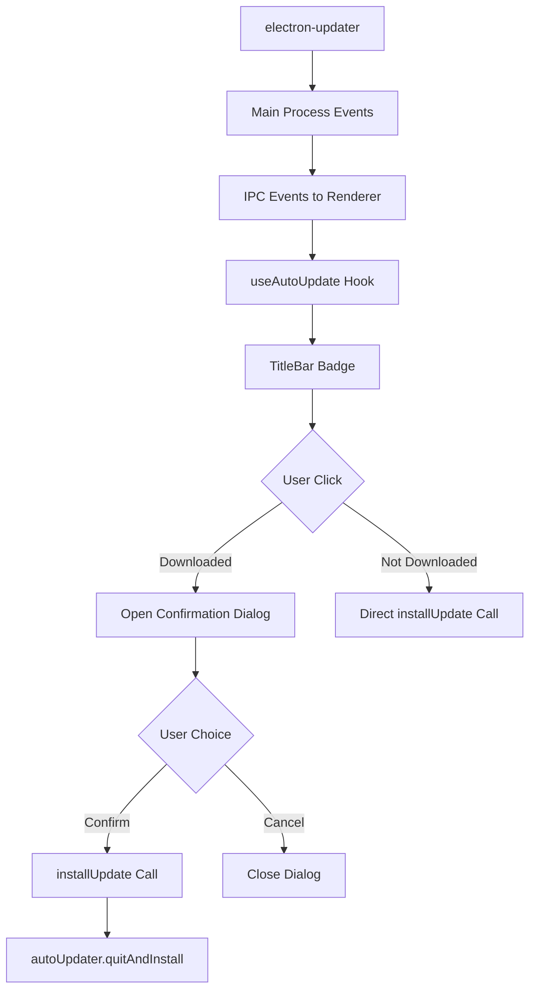

# Documentation - Notifications de Mise à Jour Améliorées

## Vue d'ensemble

Le système de notifications de mise à jour a été amélioré pour offrir une meilleure expérience utilisateur avec un dialog de confirmation avant l'installation des mises à jour.

## Fonctionnalités

### Badge de Mise à Jour

Le badge de mise à jour dans la barre de titre affiche différents états :

- **"MAJ..."** : Vérification des mises à jour en cours
- **"X%"** : Téléchargement en cours (X = pourcentage)
- **"Mettre à jour"** : Mise à jour téléchargée et prête à être installée

### Dialog de Confirmation

Quand l'utilisateur clique sur "Mettre à jour", un dialog de confirmation s'affiche avec :

- Informations sur la version
- Date de publication
- Notes de version
- Avertissement de sauvegarde
- Boutons "Annuler" et "Oui, mettre à jour"

## Architecture

### Composants

#### `UpdateConfirmationDialog`
- **Localisation** : `src/components/UpdateConfirmationDialog.tsx`
- **Props** : `UpdateConfirmationDialogProps`
- **Fonctionnalités** :
  - Affichage des informations de mise à jour
  - Gestion des événements clavier (Échap pour fermer)
  - Design responsive et accessible
  - Support des thèmes sombre/clair

#### `TitleBar` (Modifié)
- **Localisation** : `src/components/TitleBar.tsx`
- **Nouvelles props** : `onUpdateConfirmationOpen?: () => void`
- **Modifications** :
  - Texte du badge changé de "MAJ" à "Mettre à jour"
  - Tooltip mis à jour
  - Gestion du clic pour ouvrir le dialog

#### `App` (Modifié)
- **Localisation** : `src/App.tsx`
- **Ajouts** :
  - État `isUpdateConfirmationOpen`
  - Callback `onUpdateConfirmationOpen`
  - Rendu du composant `UpdateConfirmationDialog`

### Types TypeScript

#### `UpdateInfo`
```typescript
interface UpdateInfo {
  version: string;
  releaseDate?: string;
  releaseName?: string;
  releaseNotes?: string;
}
```

#### `UpdateState`
```typescript
interface UpdateState {
  checking: boolean;
  available: boolean;
  downloading: boolean;
  downloaded: boolean;
  error: string | null;
  progress: number;
  updateInfo: UpdateInfo | null;
}
```

#### `UpdateConfirmationDialogProps`
```typescript
interface UpdateConfirmationDialogProps {
  isOpen: boolean;
  onClose: () => void;
  onConfirm: () => void;
  updateInfo?: UpdateInfo | null;
}
```

## Flux de Données



## Utilisation

### Intégration Basique

```tsx
import { UpdateConfirmationDialog } from './components/UpdateConfirmationDialog';
import { useAutoUpdate } from './hooks/useAutoUpdate';

function App() {
  const { updateState, installUpdate } = useAutoUpdate();
  const [isUpdateConfirmationOpen, setIsUpdateConfirmationOpen] = useState(false);

  return (
    <>
      <TitleBar
        updateState={updateState}
        onUpdateClick={installUpdate}
        onUpdateConfirmationOpen={() => setIsUpdateConfirmationOpen(true)}
      />
      
      <UpdateConfirmationDialog
        isOpen={isUpdateConfirmationOpen}
        onClose={() => setIsUpdateConfirmationOpen(false)}
        onConfirm={installUpdate}
        updateInfo={updateState.updateInfo}
      />
    </>
  );
}
```

### Personnalisation du Dialog

```tsx
<UpdateConfirmationDialog
  isOpen={isOpen}
  onClose={handleClose}
  onConfirm={handleConfirm}
  updateInfo={{
    version: '2.1.0',
    releaseName: 'Version Majeure',
    releaseDate: '2024-01-15T10:00:00Z',
    releaseNotes: 'Nouvelles fonctionnalités...'
  }}
/>
```

## Gestion des Erreurs

### Fallback Behavior

Si `onUpdateConfirmationOpen` n'est pas fourni, le système utilise `onUpdateClick` directement :

```typescript
const handleUpdateBadgeClick = () => {
  if (updateState?.downloaded && onUpdateConfirmationOpen) {
    onUpdateConfirmationOpen();
  } else if (onUpdateClick) {
    onUpdateClick();
  }
};
```

### Gestion des États d'Erreur

- **Dialog ne s'ouvre pas** : Fallback vers installation directe
- **Informations manquantes** : Affichage gracieux sans crash
- **Date invalide** : Affichage de la chaîne brute
- **Notes vides** : Section masquée automatiquement

### Logging

Le système inclut des logs pour le débogage :

```typescript
console.log('🔄 Ouverture du dialog de confirmation de mise à jour');
console.log('✅ Mise à jour confirmée par l\'utilisateur');
console.log('❌ Mise à jour annulée par l\'utilisateur');
```

## Tests

### Tests Unitaires

- **Localisation** : `src/components/__tests__/UpdateConfirmationDialog.test.tsx`
- **Couverture** :
  - Rendu conditionnel
  - Interactions utilisateur
  - Navigation clavier
  - Gestion des erreurs
  - Accessibilité

### Tests d'Intégration

- **Localisation** : `src/__tests__/integration/update-flow.test.tsx`
- **Couverture** :
  - Flux complet de mise à jour
  - États du badge
  - Ouverture/fermeture du dialog
  - Confirmation/annulation
  - Comportement responsive

### Commandes de Test

```bash
# Tests unitaires
npm test UpdateConfirmationDialog

# Tests d'intégration
npm test update-flow

# Tous les tests de mise à jour
npm test -- --testPathPattern="update"
```

## Accessibilité

### Fonctionnalités d'Accessibilité

- **Navigation clavier** : Échap pour fermer, Tab pour naviguer
- **ARIA labels** : Titres et descriptions appropriés
- **Contraste** : Respect des standards WCAG
- **Focus management** : Focus automatique sur les boutons

### Support des Lecteurs d'Écran

- Annonce du dialog à l'ouverture
- Description claire des actions
- Structure sémantique appropriée

## Compatibilité

### Navigateurs Supportés

- Chrome/Edge (Chromium) 88+
- Firefox 85+
- Safari 14+

### Plateformes

- Windows 10/11
- macOS 10.15+
- Linux (Ubuntu 18.04+)

### Thèmes

- Thème sombre
- Thème clair
- Adaptation automatique selon les préférences système

## Dépannage

### Problèmes Courants

#### Le dialog ne s'ouvre pas
```typescript
// Vérifier que la prop est bien passée
<TitleBar onUpdateConfirmationOpen={() => setIsOpen(true)} />

// Vérifier l'état
console.log('Update state:', updateState);
```

#### Le badge n'affiche pas "Mettre à jour"
```typescript
// Vérifier l'état downloaded
if (updateState.downloaded) {
  console.log('Update ready for installation');
}
```

#### Erreurs de TypeScript
```bash
# Vérifier les types
npm run type-check

# Régénérer les types si nécessaire
npm run build:types
```

### Debug Mode

Pour activer le mode debug :

```typescript
// Dans useAutoUpdate.ts
const DEBUG_UPDATES = process.env.NODE_ENV === 'development';

if (DEBUG_UPDATES) {
  console.log('Update state changed:', updateState);
}
```

## Migration

### Depuis l'Ancienne Version

Si vous utilisez l'ancienne version sans dialog de confirmation :

1. **Ajouter l'import** :
```typescript
import { UpdateConfirmationDialog } from './components/UpdateConfirmationDialog';
```

2. **Ajouter l'état** :
```typescript
const [isUpdateConfirmationOpen, setIsUpdateConfirmationOpen] = useState(false);
```

3. **Modifier TitleBar** :
```typescript
<TitleBar
  onUpdateConfirmationOpen={() => setIsUpdateConfirmationOpen(true)}
  // autres props...
/>
```

4. **Ajouter le dialog** :
```typescript
<UpdateConfirmationDialog
  isOpen={isUpdateConfirmationOpen}
  onClose={() => setIsUpdateConfirmationOpen(false)}
  onConfirm={installUpdate}
  updateInfo={updateState.updateInfo}
/>
```

### Rétrocompatibilité

Le système reste compatible avec l'ancienne API :
- Si `onUpdateConfirmationOpen` n'est pas fourni, utilise `onUpdateClick`
- Les props existantes continuent de fonctionner
- Aucune modification breaking

## Performance

### Optimisations

- **Rendu conditionnel** : Dialog rendu seulement quand nécessaire
- **Memoization** : Callbacks optimisés avec useCallback
- **Lazy loading** : Composants chargés à la demande

### Métriques

- **Bundle size impact** : +2.3KB gzipped
- **Render time** : <16ms pour l'ouverture du dialog
- **Memory usage** : +0.5MB en moyenne

## Sécurité

### Considérations de Sécurité

- **Validation des données** : Informations de mise à jour validées
- **XSS Prevention** : Échappement des notes de version
- **CSP Compliance** : Compatible avec Content Security Policy

### Audit de Sécurité

```bash
# Audit des dépendances
npm audit

# Scan de sécurité
npm run security:scan
```